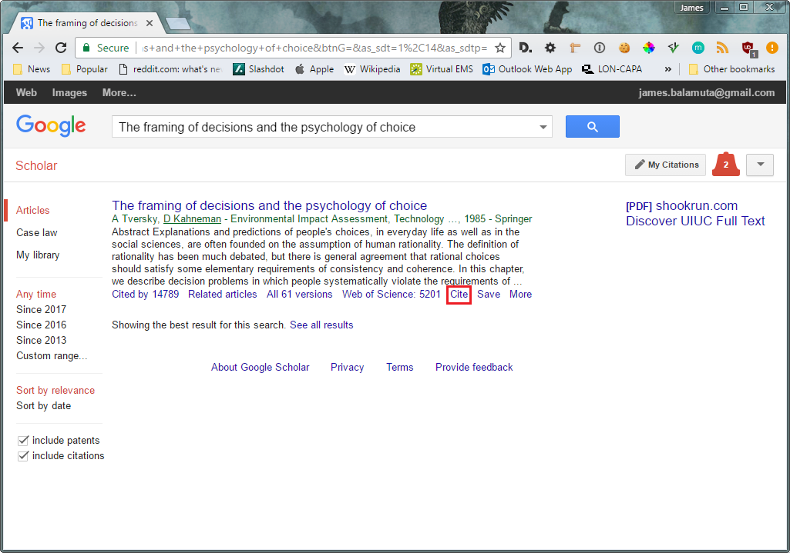
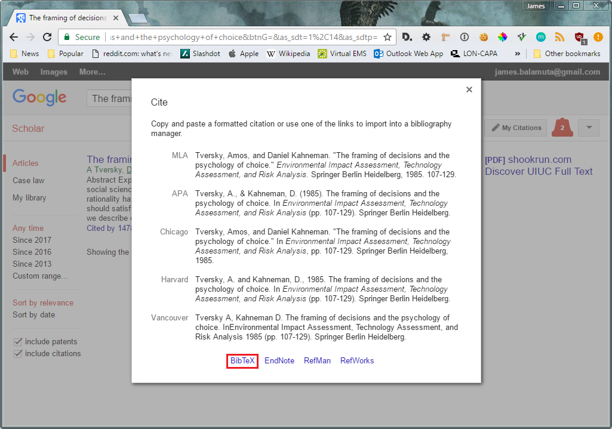

```{r setup, echo=FALSE, message=FALSE, warning = FALSE}
library("knitr")
options(width = 55)

# Disable evaluation unless requested
opts_chunk$set(eval=FALSE)

# code externalization
read_chunk('r_lec03_literate_programming.R')
```

```{r loadpackages, eval = TRUE, echo = FALSE, message = FALSE}
```

### Announcements

- HW1 released later tonight
  - **Due Sunday, June 25th, 2017 @ 11:59 PM CDT**
- [Week 1 lecture feedback survey](https://goo.gl/forms/rYOmM8fda68jMOi33)
  - Your chance to provide feedback and shape the course!

### On the Agenda   

\begin{multicols}{2}
\tableofcontents[]
\end{multicols}

# Literate Programming
## Background

### Motivation

> "Let us change our traditional attitude to the construction of programs: 
> Instead of imagining that our main task is to instruct a computer what to do,
> let us concentrate rather on explaining to human beings what we want a computer
> to do."
> 
> --- Donald Knuth in Literate Programming (1984) on pg. 1

### Literate Programming

**Definition:** Literate Programming is the notion of encouraging *programmers*
to interleaving code within narrative content that follows the 
natural logic and flow of human thought. 

In essence, the object is to write an essay that serves as a means to provide
documentation for the program simultaneously.

### Literate Programming in R

The primary tools available to perform literate programming in _R_ are:

- [`markdown`](https://daringfireball.net/projects/markdown/syntax), 
- [`rmarkdown`](https://cran.r-project.org/package=rmarkdown), and 
- [`knitr`](https://cran.r-project.org/package=knitr)

We will be exploring these tools in depth within this lecture.

## Markdown

### Markdown

- [**Markdown**](http://daringfireball.net/projects/markdown/) allows you to write
a file format independent document using an easy-to-read and easy-to-write plain
text format.
- Instead of **marking *up* text** so that is easy for a computer to read...
    - e.g. HTML: `<html><body><b>Name</b></body></html>`
- The goal is to **mark *down* text** so that is human readable:
    - e.g. `**Name**`

### Example Markdown Document

\begin{center}
\includegraphics[scale=.3]{img/rmd/rmarkdown_overview.png}
\end{center}

### Popular Use Cases of Markdown

You may not realize it, but if you ...

- wrote a `README.md` on [GitHub](www.github.com) 
- asked or answered a question on [StackOverflow](www.stackoverflow.com)
- created a thread or wrote a comment on [Reddit](www.reddit.com)

... , then you _used_ Markdown!

### Supported Output Files

As a result of Markdown being structured so loosely, any file format can be
generated using [pandoc](http://johnmacfarlane.net/pandoc/). 

That is to say, from one Markdown document you can generate any of the following:

- docx
- PDF
- HTML
- ODT
- RTF

**The downside is that there is less control over formatting.** This translates
over to being unable to effectively set new pages or specify color.

## R + Markdown

### RMarkdown

[RMarkdown](http://rmarkdown.rstudio.com/) developed by [RStudio](http://www.rstudio.com)
takes what Markdown has established and extends it significantly by:

- Allowing _R_ code and its results to be merged with Markdown;
- Ensuring that RMarkdown documents are fully reproducible;
- Enabling extra modifications to original markdown specification.

### Why learn RMarkdown?

- It's a highly flexible format that allows for easy report generation.
- Provides a way to perform _literate programming_.
- There are countless applications that grow each day:
    - [`blogdown`](https://github.com/rstudio/blogdown): Create a blog
    - [`bookdown`](https://github.com/rstudio/bookdown): Write a book
    - [`rticles`](https://github.com/rstudio/rticles): Write a LaTeX journal articles
    - [`flexdashboard`](https://github.com/rstudio/flexdashboard): Interactive dashboards
    - [`uiucthemes`](https://cran.r-project.org/package=uiucthemes): The theme of this slide deck!

### Creating an RMarkdown Document

To create an RMarkdown or `.Rmd` Document within RStudio:

\begin{columns}[t]
\column{.32\textwidth}
\centering
\begin{block}{Click the \textcolor{white}{White Plus} \\  Select \texttt{`R Markdown'}}
\centering
\includegraphics[scale=0.5]{img/rmd/file_new_rmd.png}
\end{block}
\column{.5\textwidth}
\centering
\begin{block}{Enter Document Title}
\centering
\includegraphics[scale=0.35]{img/rmd/select_new_rmd.png}
\end{block}
\end{columns}

### Initial RMarkdown View

\begin{center}
\includegraphics[scale=0.40]{img/rmd/default_rmd.png}
\end{center}

### Compiling RMarkdown Document

Use either:

- An RStudio shortcut
    - Windows: `Ctrl`+`Shift`+`K`
    - macOS: `Command`+`Shift`+`K`
- The "Knit .." button on the source editor window

\begin{center}
\includegraphics[scale=0.5]{img/rmd/compile_rmd.png}
\end{center}

- Or, compile the document via `rmarkdown::render()`
    - more on this later...


### Sample Render of Default RMarkdown View

\begin{center}
\includegraphics[scale=0.25]{img/rmd/default_rmd_view.png}
\end{center}

# RMarkdown Structure

### Sections of an RMarkdown Document

There are principally _three_ sections to an RMarkdown document.

- YAML header
- Code chunks
- Copious amounts of text!

## YAML Header

### YAML Header and the RMarkdown Document Properties

- [_YAML_](http://yaml.org/)
    - stands for _YAML Ain't Markup Language_, which is a recursive acronym! 
    - provides standardized syntax for storing data configurations.
    - properties are set via `key: value`
- YAML is used to specify RMarkdown document properties like:
    - Name of the document
    - Date
    - Output format (pdf, docx, et cetera)
    - And many more.

### Example YAML Document Header

```markdown
---
title: "Hello RMarkdown World" # Title of the document
author: "James Balamuta"       # Set the author
date: "June 15th, 2017"     # Set today's date
output:
  html_document:               # Custom format options 
    toc: true                  # Display a table of contents
---
  
Once upon a time... 
```

### Outputing multiple files from a single RMarkdown

```markdown
---
title: "Sample Document"
author: "James Balamuta"
date: "June 15th, 2017"
output:
  html_document:
    toc: true            # Table of contents
    theme: cerulean      # Bootstrap theme
  pdf_document:
    toc: true            # Table of contents
    keep_tex: true       # Retain .tex file used for .pdf
  word_document:
    fig_width: 5         # Set figure width
    fig_height: 5        # Set figure height
    fig_caption: true    # Output captions with figures
---
```


### Compiling .Rmd to .*

Compile via RStudio to .html document:

\includegraphics[scale=0.5]{img/rmd/compile_rmd.png}

Switching to a different output format (PDF^[Requires a LaTeX distribution installed on ones system.] 
in this case):

\begin{center}
\includegraphics[scale=0.5]{img/rmd/other_options.png}
\end{center}


### Compiling .Rmd to .* via R CLI

Single line output declarations

```r
library("knitr")
knit2html("input.Rmd") # Creates .html file
knit2pdf("input.Rmd")  # Creates .pdf file
knit("input.Rmd")      # Creates .md file
```

Or use for multiline output declarations

```r
library("rmarkdown") 
render("input.Rmd", "pdf_document")
render("input.Rmd", "word_document")
render("input.Rmd", "md_document")
```

### Options... Options... Options...

Some of RMarkdown's output options can be configured via a GUI in RStudio^[To see all the options granted by RMarkdown, check out the package website at:
<http://rmarkdown.rstudio.com/>.]

```{r rmd_options, cache = TRUE, echo = FALSE, eval = TRUE, fig.align='center', out.width='4cm'}

```

```{r rmd_options_in_rstudio, cache = TRUE, echo = FALSE, eval = TRUE, fig.align='center', out.width='4cm'}
knitr::include_graphics("img/rmd/rmd_options_in_rstudio.png")
```


## Code Chunks

### Dynamic Code Chunks

To initiate a code chunk within RMarkdown, all one needs to do is use:


``````r
```{r chunk_label} `r ''`
# Code here
```
``````
    
**Example:**

Here we will embed the output of obtaining 10 random numbers. 

``````r
```{r chunk_demo} `r ''`
x = runif(10)
print(x)
```
``````
    
- What may be slightly problematic about a discussion that follows 10 random numbers?

### Code Chunks Options

Each code chunk can receive further customization via chunk options. The values
supplied by the code chunk options must be valid _R_ expressions
(e.g. `TRUE` or "10px").

``````r
```{r chunk_label, chunk_opt1 = value1, chunk_opt2 = value2} `r ''`
# Code here
```
``````

As an example, we can prevent a code chunk from running by setting the chunk
option `eval = FALSE`.

``````r
```{r chunk_label, eval = FALSE} `r ''`
x = letters[1:10]
print(x) 
```
``````

### Top Code Chunk Options^[More options: <http://yihui.name/knitr/options>]

| Chunk Option           | Description                       |
|:-----------------------|:---------------------------------:|
| `cache = TRUE`         | Stores to file code chunk results |
| `eval = FALSE`         | Doesn't evaluate/run the code     |
| `eval = 2:3`           | Evaluate only lines 2 and 3       |
| `echo = FALSE`         | Doesn't display the code          |
| `echo = -c(1,3,4)`     | Hide only lines 1, 3 and 4        |
| `results = 'hide'`     | Doesn't display code output       |
| `include = FALSE`      | Doesn't display code or output    |
| `fig.path = 'img/'`    | File path to store images         |
| `fig.align = 'center'` | Align image in the center         |
| `fig.width = #`        | Sets width of figure              |
| `fig.height = #`       | Sets height of figure             |
| `warning = FALSE`      | Hides R's warning messages        |
| `message = FALSE`      | Hides R's note messages           |

### In-line R code for RMarkdown

RMarkdown also has the ability to microembed code by using an inline operator
that refers to an R expression: 

```{r inline_oops_example}
`r expression_here`
```

**Example:**

```{r example_inline_r_rmd_V1}
Did you know that there are `r nrow(apples)`
observations and `r ncol(apples)` variables 
contained within the apples data set?
```

A couple of remarks:

- All inline commands must be on the same line (no returns)!
- Helpful to have code chunk hidden before paragraph and use inline features 
  to control output.


## Writing Content 


### Examples of Markdown syntax

```markdown
Writing text with emphasis in *italics*, **bold** and 
`code style`.  

Line breaks create a new paragraph.

Links can be hidden e.g. [illinois](www.illinois.edu) or
not <http://illinois.edu> .

Sample Image:


```

### Rendered Example of Markdown syntax

Writing text with emphasis in *italics*, **bold** and 
`code style`.  

Line breaks create a new paragraph.

Links can be hidden e.g. [illinois](www.illinois.edu) or
not <http://illinois.edu> .

Sample Image:

```{r i_mark_bold, cache = TRUE, echo = FALSE, eval = TRUE, fig.align='center', out.width='2.5cm'}
knitr::include_graphics('img/i_mark_bold.png')
```

### Examples of Markdown syntax (Con't)


```markdown
> "Never gonna give you up, never gonna let you down..."
>
> --- Rick Astley

- generic
- bullet point
- listing

1. Ordered number list
1. is numbered
42. correctly

Inline math $a^2 + b^2 = c^2$

Display math (centered math) $$1 - x = y$$
```

### Rendered Example of Markdown syntax (Con't)

> "Never gonna give you up, never gonna let you down..."
>
> --- Rick Astley

- generic
- bullet point
- listing

1. Ordered number list
1. is numbered
42. correctly

Inline math $a^2 + b^2 = c^2$

Display math (centered math) $$1 - x = y$$

### Example of a Table Style in Markdown

There are many [variants of tables](http://rmarkdown.rstudio.com/authoring_pandoc_markdown.html#tables) available for Markdown. The `pipe_tables` is the preferred tabular format.

```markdown
| Left               | Center         | Right  |
|--------------------|:--------------:|-------:|
| Hey, check it out  | Colons provide |    873 |
| its **Markdown**   | alignment thus |   1000 |
| right in the table | *centered* text|        |
```

**Renders as:**

| Left               | Center         | Right  |
|--------------------|:--------------:|-------:|
| Hey, check it out  | Colons provide |    873 |
| its **Markdown**   | alignment thus |   1000 |
| right in the table | *centered* text|        |


# Advanced Features

## Global Options

### Setting Global Chunk Options

Instead of declaring options repetitively across multiple code chunks, it is better to create a global declaration in a "setup" chunk at the start of the document. 

Even with a global declaration, values are able to be changed locally on code chunks on an as needed basis. The local values will not affect future code chunks.

To set global chunk settings use:

```{r set_global}
library("knitr") # Make sure this is loaded!

opts_chunk$set(eval = FALSE, comment = NA, 
               fig.width = 6, fig.height = 6, 
               fig.align = 'center')
```

## Caches

### Caching

**Caching** refers to storing data locally in order to speed up subsequent retrievals.

In essence, the code chunk will be run once, the resulting objects are then stored within a file, and the stored data is then displayed on subsequent runs.

This feature is very handy when embedding analysis on large data sets or time intensive computations.

### Be Careful When Caching...

Simple yet problematic cache:

``````r
```{r cache_demo, cache = TRUE} `r ''`
x = rnorm(5)
```
``````

```{r cache_demo, cache = TRUE, eval = TRUE, echo = FALSE}
(x = rnorm(5))
```

### The Problematic Cache

Suppose you have three code chunks, say $A$, $B$, and $C$, that each use a
random number generation (RNG) routine and have been evaluated with the option
`cache = TRUE`.

If the code chunk $C$ is inserted between $A$ and $B$, then the order updates to
$A$, $C$, and $B$. However, the values have been _cached_ and a subsequent, re-running 
of the document will **not** change generated values.

This is problematic as the _order_ in which the RNG modifies `.Random.seed` is
no longer consistent. As a result, if the cache becomes _invalidated_ or deleted,
then the reproducibility of the results comes into question.

That is to say: **The reproducibility of $B$ and $C$ is now bogus.**

### Solutions for the Problematic Cache

There have been many solutions put forward to address the problematic caching
behavior described above. A few of them are as follows:

- Associate the `.Random.seed` with the cache for each chunk
- If a domino block computation, use `dependson = <chunk-name>` chunk option.
- Cache by Session or File information.

### Associating `.Random.seed` with Code Chunks

To guarantee reproducibility with RNG, `.Random.seed` needs to be associated
with the cache for each chunk using:

```{r set_extra_cache_opt, cache = TRUE}
```

### Using `dependson`

If results depend on a previous chunk's work, then it make sense to apply a
dependency via the `dependson='chunk-name'` option. 

**Origin Chunk**
``````r
```{r chunk_A, cache = TRUE} `r ''`
set.seed(12354)
x = runif(10)
```
``````

**Add-on Dependency**
``````r
```{r chunk_B, cache = TRUE, dependson="chunk_A"} `r ''`
y = x + 100
```
``````

### Global `dependson` option

To use the global `dependson` option we need to set the `autodep = TRUE` global
chunk option.^[This option is not ideal since if variables share the same name
anywhere and are slightly changed, then an update is forced automatically.]

```{r global_depends, eval = FALSE}
library("knitr")

# Set global chunk options
opts_chunk$set(cache = TRUE, autodep = TRUE)
```


### The Limiting Cache Scope

Sometimes the cache needs to be limited by R version, Session Info, or a time stamp.

```{r set_extra_cache_opt_limit, cache = TRUE}
```


### Limit Cache by File Info

Limit cache using the file stamp associated with data files being read into R for the analysis

```{r set_individual_files, eval = TRUE}
```

``````r
```{r data_read_in, cache.extra = mtime("apple.csv")} `r ''`
data = read.csv("apple.csv")
```
``````

### Returning to In-line R code for .Rmd

Previously, we executed code inline with an actual function call: 

```{r example_inline_code}
`r dim(apples)[1]`
```

In this case, it is highly preferred to move those calls to a code chunk 
_before_ the text as this calculation can then be cached.

Code Chunk Example:

``````r
```{r data_inline_calc, cache = TRUE} `r ''`
data("apples")      # Loads the apple data set.
obs  = nrow(apples) # Number of observations in the dataset
vars = ncol(apples) # Number of variables in the dataset
```
``````


### Revisiting Inline Code

In document:

```{r example_inline_r_rmd2}
Did you know that there are `r obs` observations 
and `r vars` variables contained within the apples 
data set?
```

Compared to the previous approach, we now have:

- Cached computations
- Clearer function calls
- Less obtrusive explanations. 

## Code Externalization 

### Separation of Concerns

When we first began using `rmarkdown`, the R code was directly embedded into the .Rmd file. 

\begin{center}
{\textbf{This is not a good practice in general.} }
\end{center}

Why? The elements of the analysis are then merged with elements of the presentation.

If the code is externalized:

1. The code can be run without compiling the document. 
1. Sharing the code with others is easier.
1. Switch between presentation slides and the code during the actual presentation.


### Code Externalization in Action

To externalize code, the r code file must contain comments of the form:

\begin{center}\#\# -\,-\,-\,- label or \#\# @knitr label\end{center},
where label denotes a code chunk name.

Example Code File: **analysis_code.R**

```{r external_code_fake}
# Label code as:

## @knitr external_code
(x = "Rawr?")

# or 

## ---- external_code
(x = "Rawr?")
```

### Sample External Code Read In

Example .Rmd File: **analysis_writeup.Rmd**

```{r external_code_load, echo = TRUE}
```

Activate Code Chunk in Document:

``````r
```{r external_code, echo = TRUE} `r ''`
```
``````

Result:

```{r external_code, eval = TRUE}
```

## Reusing Code

### Reusing Code Chunks

By labeling code chunks, `knitr` is able to call them in the future or embed 
them within other code chunks.

To reuse the code from `<<chunk-name>>`, call it from within:

```{r inline_oops}
`r chunk_embedded_var`.
```

### Reusing Code Chunks Example

Initial chunk:

``````r
```{r chunk-name} `r ''`
test = "hello"
```
``````
    
Embedded Chunk:

``````r
```{r chunk-embedded} `r ''`
<<chunk-name>>
```
``````

Result:

```{r chunk-embedded-display, eval = TRUE, size = 'footnotesize'}
"hello"
```


## Bibliographies

### BibTex
In RStudio, we are able to use BibTex to generate bibliographies.

BibTex is a way to structure output of paper citations you can obtain from 
[Google Scholar](https://scholar.google.com/)

### Google Scholar Search Portal

Just like with regular ol' Google, type in to the search bar either the
full paper names or just key terms that you are interested in.

```{r google_scholar, cache = TRUE, echo = FALSE, eval = TRUE, fig.align='center', out.width='8cm'}
knitr::include_graphics("img/scholar/google_scholar.PNG")
```

### Obtaining a citation from Google Scholar

Once you found the paper you were looking for, press the `Cite` button.

```{r google_scholar_search_result, cache = TRUE, echo = FALSE, eval = TRUE, fig.align='center', out.width='8cm'}

```

### Navigating Citation Options

From the citation menu, there are many different export options. In our case, we'll opt for the `BibTeX` option.

```{r google_scholar_cite_options, cache = TRUE, echo = FALSE, eval = TRUE, fig.align='center', out.width='8cm'}

```

### Copying the BibTex Citation.

From here, use either `CNTRL` + `C` (Windows/Linux) or `CMD` + `C` (macOS) to
copy the citation.

```{r google_scholar_bibtex, cache = TRUE, echo = FALSE, eval = TRUE, fig.align='center', out.width='8cm'}
knitr::include_graphics("img/scholar/google_scholar_bibtex.PNG")
```

### Structuring a `.bib` file

Bibliography information is stored in a `.bib` file, which is just a regular
text file.

Here is the `mybiblib.bib` with the citation used in the previous example:

\footnotesize

```
@incollection{tversky1985framing,
  title={The framing of decisions and the psychology of choice},
  author={Tversky, Amos and Kahneman, Daniel},
  booktitle={Environmental Impact Assessment, Technology Assessment,
             and Risk Analysis},
  pages={107--129},
  year={1985},
  publisher={Springer}
}# Additional entries...
@book{ho1987,
  title={Rational choice: Contrast between economics and psychology.},
  author={Hogarth, Robin M and Reder, Melvin W},
  year={1987},
  publisher={University of Chicago Press}
}
```

### YAML for including a bibliography

```markdown
---
title: "Example Biblography heading"
output: html_document
bibliography: bibliography.bib
---
```

Reference in the document using: 

- Authors + Year e.g. `[@tversky1985framing]`
    - "Choice is important (Tversky and Kahneman 1985)".
- Suppress author information and only have a year e.g. `[-@tversky1985framing]`
    - Tversky says, "Choice is important (1985)".

## Tables

### knitr's `kable()`

The main benefit to `kable()` is not having to worry about the mode `knitr`
is currently in (e.g. html, latex, or markdown) and its ability to split tables
over pages.^[Make sure to set the chunk option `results = 'asis'`.]


### Demo of `kable()`

\scriptsize

```{r results='asis'}
<<kable_example>>
```

\normalsize

```{r kable_example, eval = TRUE, results = 'asis', echo = FALSE}
```

## Code Engines

### Different Language Engines

RMarkdown supports a large variety of different languages.^[Assuming each language is installed and available on your system's `PATH` variable] 
This allows for you to embed code in an RMarkdown document and receive results
from the desired langauage. Some supported languages include:

- `Rcpp`, `bash`, `python`, `sas`, `sql`, `c`, `fortran`, and `stata`.

To do so, simply replace the `r` at the start of the chunk with the correct
engine name.^[Unlike _R_, the results from each code chunk may not persist for a given language engine.]

``````bash
```{bash chunk_engine_demo} `r ''`
# We're in bash now!
echo $HOME
```
``````
