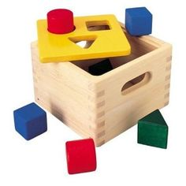
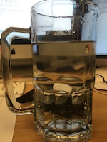
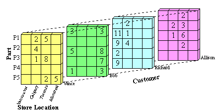

### Last Time

1. Talked about Literate Programming using RMarkdown
2. Discussed version control with `git` and GitHub
3. Assigned Homework

### Announcements

1. You _must_ be in a group by tomorrow! (June 20th, 2017)
2. E-mail me the names and NetIDs of your group members. 

### On the Agenda   

\begin{multicols}{2}
\tableofcontents[]
\end{multicols}


# Writing Good Code

## Intro

### Writing Code

> Good artists copy; great artists steal.
>
> --- Steve Jobs (quoted to Picaso but really T.S Elliot)

- To some degree, we will reinvent the wheel while showing concepts. 
- In other cases, you will stand on the shoulders of those that came before you
  to create something new.

## Locating Code

### Finding Code

As an homage to its open source roots, all R code is immediately accessible by 
just typing the function name.

```{r}
isTRUE
```

### Finding Code by Digging Deeper

Sometimes, we may need to pry into R using:

- Packages or built-in R functions
    - [`lookup` package](https://github.com/jimhester/lookup)'s `lookup()`
    - [`pryr` package](https://cran.r-project.org/web/packages/pryr/index.html)'s `fun_body()`
    - R's `getAnywhere()` or `methods()`
- GitHub's search engine to locate a function or an idea.
    - Search the code of packages on [CRAN](https://cran.r-project.org/) via [org:cran](https://github.com/search?q=org%3Acran) 
    - Search **all** _R_ code on GitHub with [language:r](https://github.com/search?q=language%3Ar)

## Style Guide

### The Importance of Being Consistent

- When writing code, it is important, especisally in large organizations, to have a **consistent** style.
- Did you know that UIUC has its own [identity standards](http://identitystandards.illinois.edu/graphicstandardsmanual/index.html)? 
- For instance, to use UIUC's I-logo, university personnel and vendors must adhere to the correct usage case:

\begincols
\column{0.49\linewidth}

```{r cache = TRUE, out.width="8cm", fig.align='center', echo = FALSE, fig.cap='Correct'}

```

\column{0.49\linewidth}

```{r cache = TRUE, out.width="1cm", fig.align='center', echo = FALSE, fig.cap='Incorrect'}

```
\endcols

### Style Guide

- In that vein, organizations, like Google, have created an internal 
  [style guides](https://google.github.io/styleguide/Rguide.xml) for code.
- Now, style guides are not per say the *best* practices to use. 
- Instead, they serve to unify the code written by a bunch of different individuals. 

### Class Style Guide

- For the most part, we will follow [Google's style advice](https://google.github.io/styleguide/Rguide.xml),
  which is also used by many developers.
- The main exception to this principle is the avoidance of using the `<-` and
  `->` assignment operators outside of piping (more later). 
    - Of course, you can also switch this by using [formatR](http://yihui.name/formatR/)
    by [Yihui Xie](http://yihui.name) ([knitr author](http://yihui.name/knitr)).

```{r}
x = 1  # Good

x <- 1 # Bad
```

### Examples of Style

\scriptsize

```r
# Good Style
is_positive_number = function(x) {

  if (x > 0) {
    is_pos = TRUE
  } else {
    is_pos = FALSE
  }
  
  is_pos
}

# Bad Style
isPostive_number = function(x){
  if(x > 0){ 
    isPos = TRUE
  }else{
    return(F)
  }
  
  isPos
}
```

# Data Types

## Definitions

### Data Types

To a computer, each *variable* must have a specific kind of *data type*. 

**Definition:** *Data type* is a description that indicates the type of data that can object can hold.

```{r shape_game, out.width = "3.5cm", fig.retina = NULL, fig.align='center', echo = F, cache = T}

```

It is important that the data are matched with the approriate type.

### Supported Data Types

The different types of data supported by `R` are as follows:

- Numeric (double/float)
    - Examples: `-2`, `0.0`, `6.1`, `41.234`
- Integer
    - Examples: `-2L`, `0L`, `3L`, `10L`
- Complex
    - Examples: `-1 + 2i`, `0 + 0i`, `1 - 2i`
- Logical (boolean)
    - Examples: `TRUE` (`T`) and `FALSE` (`F`)
    - As a side note: `NA` (missing value) is also considered logical.
- Character
    - Examples: `"Hello"`, `"World"`, `"of Statistics"`, `"1 + 1"`
    
### Storing Information in a Variable

- While using R, you may wish to call a calculation at a later time.
  In such cases, it is ideal to store the computation in a **variable**.

- You do *not* need to specify the variables data type in advance as R will
  handle that for you. This is good and bad for various reasons that will be
  covered next under **coercion**.

**Sample Assignments:**

```{r}
a = 1     # Assign 1 to `a`
b = 2     # Assign 2 to `b`

d = a + b # Assign the sum of `a` and `b` to `d`.
```

### Preview Value during Assignment

Previously, we opted to assign and then output the variable contents.

```{r}
life = 42
life
```

By enclosing the assignment within paranthesis, e.g. `()`, we can omit one line:

```{r}
(life = 42)
```


## Missingness and Constants

### Built-in constants

R has a few pre-defined variables that will make life easier. 

As a result, you no longer have to google: [order of the alphabet](http://lmgtfy.com/?q=order+of+alphabet). 

```{r}
LETTERS[1:8]     # Uppercase alphabet
letters[1:8]     # Lowercase alphabet
```

### Built-in constants

```{r}
month.abb[1:8]   # Abbreviated Month Name
month.name[1:8]  # Full Month Name
pi               # Pi 
```

### Be Warned of the Redefine

You **can** overide these variables on a per session basis. 

So, be **careful** when using them. For example,

```{r}
pi        # Initial Value
pi = 3.14 # Modified the equation
pi        # View new value
```

Keep this in mind during later when we work on debugging code... 

### Storing Missingness in a Variable

> An NA is the presence of an absence. Don't forget that some missing values 
> are the absence of a presence
>
> --- Hadley Wickham [twitter](https://twitter.com/hadleywickham/status/738802081448886272)

Within R, there is a specific type that handles "missingness". 

This type is called `NA` and will be a thorn in our sides.

### Storing Missingness in a Variable

There are `NA` values for many data types. However, all you will really need is `NA`.

```{r}
(x = NA)
```

# Data Structures

## Heterogeneity and Homogenous

### Heterogeneity and Homogenous Data Structures 

R is **unique** in that it provides both _homogeneous_ and _heterogeneous_
data structures to store elements in.

- **Homogeneous**: All elements must be of the same data type.
- **Heterogenous**: Elements may be of a variety of data types.

### Heterogeneity and Homogenous Data Structures 

Example of different data types

\begincols
\column{0.49\linewidth}

```{r cache = TRUE, out.width="3.5cm", fig.align='center', echo = FALSE, fig.cap='Heterogeneous'}

```

\column{0.49\linewidth}

```{r cache = TRUE, out.width="3.5cm", fig.align='center', echo = FALSE, fig.cap='Homogeneous'}

```
\endcols


*Note:* Java Chip Frap: 4 Shots + 10 Frap Chips

## Types

### Heterogeneity vs. Homogenous Data Structures

The different data structures are as follows:

| Dimensions   | Homogeneous          | Heterogeneous |
|--------------|----------------------|---------------|
| 1-d          | `atomic vector`      | `list`        |
| 2-d          | `matrix`             | `data.frame`  |
| n-d          | `array`              |               |

For the moment, we are going to focus on `vector` structures and `homogeneous` data.

**Questions:**

1. When might we need to use `n`-dimensions of data?
2. What happens if we mix one data type with another?
3. Which data structure could potentially rule them all? (e.g. be the parent)

### 3D Data Examples

Contour Plot showing the Topography of [Maunga Whau](https://en.wikipedia.org/wiki/Maungawhau)

```{r contour_plot, cache = TRUE, echo = FALSE, message = FALSE, warning = FALSE}
library(fields)
image.plot(volcano)
contour(volcano, add = TRUE)
```

### 3D Data Examples

Viewing Purchase decision of Customers by Part and Store.




# Atomic Vectors

## Data Types

### Atomic Vectors

The majority of work done in R uses **atomic vectors** as building blocks.

To create an empty atomic vector we can use:

```{r}
a = numeric()   # Numeric
b = integer()   # Integer
d = character() # String
e = complex()   # Complex Number
f = logical()   # Boolean
g = raw()       # Raw
```

This creates an atomic vector of length `0` of a specific type. 
```{r}
length(a) # Number of elements contained in the vector
```

### Vectors Initialization

To create a vector of length `n`, simply:

```{r}
n = 20L         # Store a number
a = numeric(n)  # Create a double
a               # View entries
length(a)       # Verify the length
```

### Vectors Initialization

Alternatively, if the values for the vector are already known, the vector can
be created using:

```{r}
(a2 = c(-1.5, 2.1, 7, 19.3, 42.8))
(b2 = c(1L, 2L))
```

Notes:

- `c()` can also be used to concatenate different (add together) objects
- Avoid naming functions or variables with `c`!

### Atomic Vector Depth

If you nest different atomic vectors with concatenation, `c()`, the
resulting atomic vector should always have dimension 1:

```{r}
c(1, c(2, c(3, 4)))  # Nested concatenation

c(1, 2, 3, 4)        # Traditional construction
```

As a result, atomic vectors must always be *flat*. 

## Properties

### Atomic Vector Properties

Each atomic vector has its own properties, in the case of `a`, we have:

```{r}
typeof(a2)       # Determine the type of `a2`
typeof(b2)       # Determine the type of `b2`
```

### Atomic Vector Properties

Attributes, which will cover in depth later, can be viewed as a way to add 
additional data or metadata.

```{r}
attributes(a)     # Access metadata of `a`
```

**Note:** The initial vector does not have any other attributes associated with it.
We can add some using:

```{r}
# Set metadata of `a` to have sample = statistics
attr(a,"sample") = "Statistics" 
attributes(a)      # Access metadata of `a`
```

### Identifying an Atomic Vector

To identify the type of an atomic vector, you can create your own check
statement or use a built-in function:

```{r eval = F}
is.character(letters)  # Checks for characters
is.double(1.2:4.4)     # Check for doubles
is.integer(1L:4L)      # Checks for integers
is.logical(c(T, F))    # Checks for booleans
is.atomic(1:4)         # Checks for atomic vector
```

**Note:** Do not use: `is.vector()`! You will be disappointed in the results.

## Mixtures

### Coercion Associated with Mixing Homogeneous Types

As hinted to earlier, it is not ideal to "mix" homogenous types. 

Mixing types has _R_ coerces the data type to a shared type. Some common
examples:

```{r}
c(1, 2L, "Toad") # Numeric/Integer + Character => Character
c(3.14, 1L)      # Numeric + Integer           => Numeric
c(2L, TRUE)      # Integer + Logical           => Integer
```

### Controlled Coercion

Explicitly coerce to another data type with `as.*()` functions. Examples:

```{r}
as.numeric(c(TRUE, FALSE)) # Logical -> Numeric
as.character(3.14)         # Numeric -> Character
as.integer(3.14)           # Numeric -> Integer
as.logical(c(1L, 0L))      # Integer -> Logical
```

# Subset

## Element Access

### Atomic Vector Access

We can access each element using the `object[]` operator. 

```{r}
a[1]     # Access and print first element

a[1] = 2 # Accesss and assign new value to first element

a[1]     # Access and print first element
```

**Note:** All vectors in *R* start with index 1. This is a common issue that
causes many bugs when incorporating _C++_ with _R_.

### Naming Atomic Vector Values

Sometimes, it might be helpful to label what each value in an atomic vector is apart of:

```{r}
x = c("sphynx" = -1, "calypso" = 2, "doomsday" = 0, 
      "life" = 42, "nine" = 9)
```

As a result, each component can be referred to by a name:

```{r}
x[c("doomsday", "life")]
```

### Naming Atomic Vector Values

All of the names of such vector can be known with:

```{r}
names(x)
```

### Subsetting with Vectors

Sometimes, we may wish to only look at a specific subset of our data.

For example, we can get elements at specific positions with:
```{r}
x[c(2, 4)]
```

Or, we can remove elements at specific positions with:
```{r}
x[-c(2, 4)]
```

### Subsetting with Vectors

Indexes must be all positive or all negative.

```{r}
c(x[-1], x[1])
```

You cannot use names to remove an element.

```{r, eval = F}
x[-c("doomsday", "life")]
# Error in -c("doomsday", "life") : 
# invalid argument to unary operator
```

## Problematic Access

### Edge Subsetting Cases


If an index is not included, then the entire vector will be displayed

```{r}
x[]   # All terms
```

If you specify 0, there will be an empty vector:
```{r}
x[0]  # Empty Vector
```

### Edge Subsetting Cases


If the element is out of bounds, then you will receive an `NA` vector
```{r}
x[9]  # Only one NA returned

x[NA] # All terms are NA
```

### Changing Element order withing Atomic Vectors

More often then not, you will want to know the progression of elements either in an increasing or decreasing form.

To do so, you can for example use: 

```{r}
x[order(x)]                   # Ascending Order

x[order(x, decreasing = T)]   # Descending Order
```

### Changing Element order withing Atomic Vectors

Alternatively, you can sort the vector
```{r}
sort(x)
```

# Vectorization

## Arithmetic

### Operations on Vectors

As stated earlier, a simple number like `42` in _R_ is considered an atomic vector.

Generally, the length of the vector is significantly longer than only `1` value. 
_R_ allows for operations to take place on these elements without having to individually
access each element. This is called _vectorization_.

### Sequence Operator

Vectors have many convenient short cuts. One of the main short cuts
is the _Colon Operator_ or `from:to` which allows for the generation of an
integer vector. 
 
 `r x = 1:5` `x = 1:5` generates a vector of length `5` that 
 contains $1,2,3, \ldots, 5$ and assigns it to `x`.
    

### Vectorized Binary Operators

| Operator | Operation Name                        |
|:--------:|:-------------------------------------:|
| `+`      | addition                              |
| `-`      | subtraction                           |
| `*`      | multiplication                        |
| `/`      | division                              |
| `^`      | exponentiation                        |
| `%%`     | modulo arithmetic or the remainder    |
| `%/%`    | integer division                      |

- **Usage:** `x o y = z`
- Operators allow the vectors to be modified by a term or another vector in
  place.


### Sequence Operator and Binary Operations

\scriptsize
```{r}
(x = 1:5)   # Define x

(y = x^2)   # Square values and store in y

sqrt(y)     # Take the square root

x %% 2      # Modulos of 2

2 * (x - 1) # Subtract one then multiply by 2
```

### Summing an atomic vector

There are two ways we can go about adding up the contents within an atomic vector.

We can use a loop:

```{r}
x = 1:5                  # Create initial vector
sumx = 0                 # Create a sum value

for(i in 1:5){           # Create an index vector
   sumx = sumx + x[i]    # Access each [i] and sum over it
}
```


### Summing an atomic vector

Or, we can use a vectorized function:

```{r}
sumx_v2 = sum(x)         # Use a vectorized calculation
```

We will need to verify if the calculation is the same:

```{r}
all.equal(sumx, sumx_v2) # Verify equality
```

## Replication

### Replicate elements

- `rep()` function provides a way to replicate values throughout the vector.

```{r}
# Generates a vector of length `5` that contains only 1
rep(1,5)
```

## Sequence Generation


### Generic Sequence Generator

- `seq(from, to)` function provides a way to create a sequence of values.
    - **Note:** This approach is considerably slower than using `1:5` due to the method's genericness.
```{r}
# Generates a vector of length `5` that contains 1, 2, 3, ... , 5
seq(1,5)
```

### Generate Sequence with Specific Step or Length

- `seq(from, to, by)`/`seq(from, to, length.out)` function provides a way to 
   create a sequence of values with a specific incrementer or length.
```{r}
# Generates a vector of length `6`
seq(0, 0.5, by = 0.1)
# Generates a vector of length `5`
seq(0, 0.5, length.out = 5)
```

- Why is there a difference between lengths?

### Generate Sequence by Length

- `seq_len()` function provides a way to create a vector based on length.
```{r}
y = c(1, 5, 6, 2, 4) # Create a vector

n = length(y)        # Obtain the Length

# Generates a vector starting at `1` and going to `n`.
seq_len(n)
```

**Note:** In the next slide deck, we will see this is a great function to use
to be a defensive programmer by protecting a loop counter.

### Generate Sequence by Vector

- `seq_along()` function provides a way to obtain an index for each element in the vector.
```{r}
y = c(1, 5, 6, 2, 4) # Create a vector

# Generates a vector starting at `1` and 
# going to `length(y)`. 
seq_along(y)
```

**Note:** In the next slide deck, we will see this is a great function to use
to be a defensive programmer by protecting a loop counter.

### Recycling Behavior of Vectorization

*Warning:* If the term being multiplied is another vector, R will recycle values
in the previous vector. 

Take for example:

```{r}
x = c(1, 2, 3, 4)   # Original
c(-1, 1)*x           # Recycled values of x
```

### Recycling Behavior of Vectorization Explained

What's happening is a ...

1. Deterimination if a vector is shorter than the other. 
2. Recycling (or an expansion) of the shorter vector until it matches the 
  longer's length.
3. Application of a _binary operation_ (e.g `+`, `-`, `*`, `/`, `%`, and `%%`)

$$
\left[ {\begin{array}{*{20}{c}}
  1 \\ 
  2 \\ 
  3 \\ 
  4 
\end{array}} \right]*\left[ {\begin{array}{*{20}{c}}
  { - 1} \\ 
  1 
\end{array}} \right]\mathop  \Rightarrow \limits^{\text{Recycling}} \left[ {\begin{array}{*{20}{c}}
  1 \\ 
  2 \\ 
  3 \\ 
  4 
\end{array}} \right]*\left[ {\begin{array}{*{20}{c}}
  { - 1} \\ 
  1 \\ 
  { - 1} \\ 
  1 
\end{array}} \right]\mathop  = \left[ {\begin{array}{*{20}{c}}
  { - 1} \\ 
  2 \\ 
  { - 3} \\ 
  4 
\end{array}} \right]
$$

### A note on shortcuts

This is helpful when constructing confidence intervals. Consider the confidence 
intervals for proportions formula:

\begin{align}
Estimate &\pm MOE \\
\hat p &\pm {z_{\alpha /2} }\left( {\sqrt {\frac{ {\hat p\left( {1 - \hat p} \right)} }{n} } } \right)
\end{align}

How could we use this property to avoid recomputing the Margin of Error (MOE)? 
