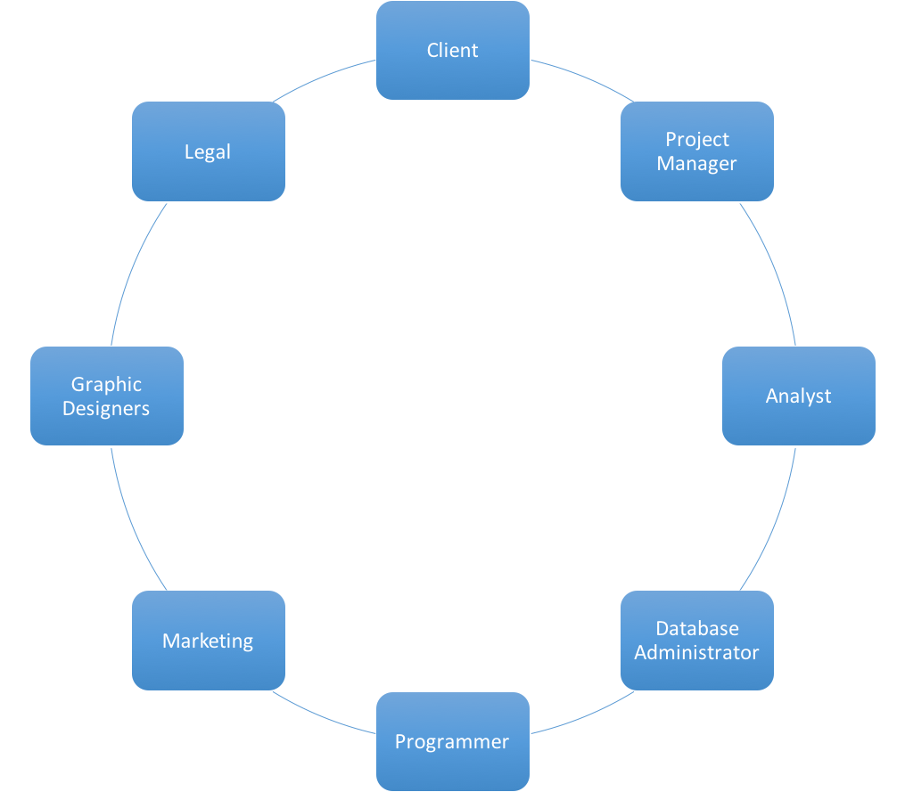
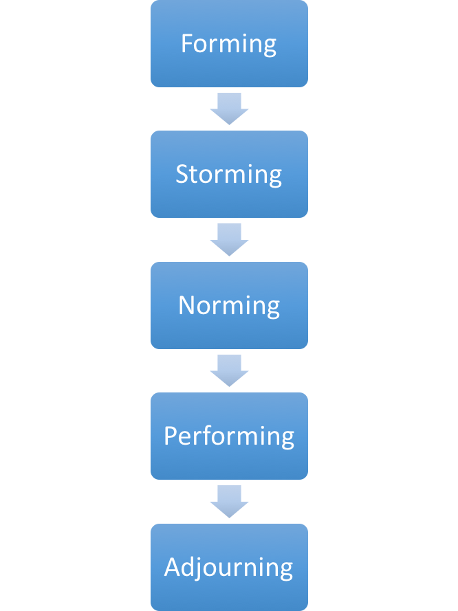

```{r setup, include=FALSE}
library("knitr")
knitr::opts_chunk$set(echo = FALSE)
```

### On the Agenda

- Effective Groups (Inspired by [Prof. Brian Bailey](https://cs.illinois.edu/directory/profile/bpbailey))
    - Why groups?
    - Stages of Group Development
    - Group Norms
    - Tools for Group Work
- Group Projects (Discussion)

# Groups

## Why Group?

### Grouping Brainstorming

Form a group of 2-3 people around you.

Take three minutes to answer the following:

- What was your *best* group experience?
- What do you like the most about group work?
- What techniques worked well for groups?

Take (another) three minutes to answer the following:

- What was your *wurst* group experience?
- What do you *dislike* the most about group work?

### Did you introduce yourself?

- When you started to talk with those around you, did you **introduce** yourself first? 
- Or did you just jump into the task?
- **Always introduce yourself *before* starting the task!**

### Why Group?

- Exposure to *new* viewpoints from different fields and life experiences
- Improves creativity and overall work quality (4 eyes vs. 2 eyes)
- Constructive dialog and increased internal group motivation
- Personal accountability to the team
- Friendship
- Prepares you for a team-environment in the workplace or a research group.

### Statistics **is** a group effort

```{r circle_of_statistics, cache = TRUE, echo = FALSE, eval = TRUE, fig.align='center', out.width='7.5cm'}

```


## Group Stages

### Stages of Group Development [@2010tuckmangroup]

```{r stages_of_group_development, cache = TRUE, echo = FALSE, eval = TRUE, fig.align='center', out.width='5cm'}

```


### Forming (Honeymoon Stage)

- **Excitement**
    - New experiences and people
- **Eagerness**
    - Working on a common new task
- **High Expectations**
    - We will be able to get a good grade.
    - We can use *this*
- **Anxiety**
    - Will I fit in?
    - Am I able to contribute?
    
### Forming (Honeymoon Stage)

Combat the **anxiety** with an ice-breaker activity:

- Try to come up with a team name
- Talk about the weather
- Fact or Fiction 
    - Write 2 facts and 1 fictional item
    - The group guesses the fictional item.

### Storming (Internal Strife)

- As you begin to work, group structure will form to ensure goals are met
    - Who is the leader? Who can write well? Who is able to program? And so on...

- Watch out for **conflict** due to group structure disagreements on roles and processes.
     - Form a consensus on different roles and processes.
     
- Some groups may skip this stage and jump to **norming**.
     
### Norming (Resolution)

- Conflicts in **Storming** are resolved due to a formed consensus. 
      - Team member idiosyncrasy are accepted or corrected.
- Team members begins focusing on the goal as group members take on their responsibilities.
- Overall, the team is ready to collaborate together toward a common goal.
      - Watch out for suppressing conflict by avoiding discussing controversial ideas!

### Performing (Working)

- Team members work fluidly together to finish the common goals.
- Main stage of the group process
- Teams may stumble back to prior stages or never reach this stage.

### Adjourning / Mourning (Finale)

- Completion of the common task and the end of the group
    - Anxiousness, Sadness, or Relief
- Reflect on how the group worked and channel it into the next group
- Congratulate team members on a job well down and note the individual contributions
- Finish any other administrative tasks
    - e.g. Write a peer review of each group member.
    
### Tips for Group Work - Part 1

- **Work Hard**
    - Do your share and more to set both an example and communicate willingness
- **Include All Team Members in Group Activities**
    - Being left out *stinks* and its hard to get over.
    - Try to provide reasonable deadlines for time sensitive decisions.
- **Take Turns**
    - Cycle leadership, following, organization, note taker, and discussant roles.
    - Promotes an atmosphere of shared equity.


### Tips for Group Work - Part 2

- **Constructive Dialog**
    - Focus on the **idea** and **not** the person proposing it.
    - Try to **extend**, **shape**, or **add** to a proposed idea
- **Data Driven Decisions**
    - Avoid "I don't like it" in favor of evidence.
    - Personal preferences are not evidence and are hard to articulate.
- **Focus on the Task**
    - Utilize your time appropriately by being prepared and ontime.

### Tips for Group Work - Part 3

- **A Happy Group Makes for Happy Group Members**
    - Make a positive statement in the beginning
    - Bring something to the meeting (e.g. food, drinks, et cetera)
- **Move On**
    - Don't sweat not being able to agree
    - Take breaks and revisit the idea later.
- **Avoid Assigning Blame**
    - Suggest ideas to fix problems
    - Try to understand the other persons viewpoint
- **Deliverables**
    - Figure out **who** is doing **what** task and **when** it will be done.

### One last tip: Groups that sit together tend to do better!

```{r smiley_face, cache = TRUE, echo = FALSE, eval = TRUE, fig.align='center', out.width='6cm'}
knitr::include_graphics("figures/smiley_face.png")
```

## Tools for Collaboration

### To tool or not to tool...

- Tools can help with:
    - organizing, allocating, and tracking the work
    - tracking discussions, issues, and decisions
    - versioning code and documents
    - collaborative programming and editing
- Tools are... well.. tools
    - no substitution for an actual human
    - some tools may work well and some may not

Next up: ***Some* Recommendations.**

### Shared Storage

- **Create a shared space to store all your materials**
    - [CITES Wiki](https://wiki.cites.illinois.edu/wiki/)
    - [Dropbox](www.dropbox.com) (2.5 gigs)
    - [BoxSync](https://app.box.com/) (50 gigs)
    - [Google Drive](https://drive.google.com) (Unlimited Storage!!!)

- Centralize files with a good file structure to avoid, "Where is XYZ? Can you send it to me?"

### Shared editing

- **Group Document Editing**
    - [Google Docs](https://docs.google.com)
    - [ShareLaTeX](www.sharelatex.com) (1 Collaborator + Supports Knitr)
    - [Overleaf](https://www.overleaf.com/) (1 gig + unlimited collaborators)
    - MS Word's [Track Document Changes](https://support.office.com/en-us/article/Track-changes-while-you-edit-024158a3-7e62-4f05-8bb7-dc3ecf0295c4)

- Allows for *simultaneous* or parallel contributions. Avoid wasting resources!

### Shared *Persistent* Discusion Environment

- **Use a discussion board**
    - [Google Groups](https://groups.google.com/forum/#!overview)
    - [Illinois Mailing Lists](http://www.cites.illinois.edu/maillist/)
    - [Create Outlook Groups](https://groups.outlook.com/)

- Facilitate *long* exchanges without having to remember lots of e-mails

### Shared Process View Tool

- **Use a Versioning Tool**
    - [git](http://git-scm.com/downloads)
    - [svn](https://subversion.apache.org/packages.html)

- See *who* did *what* and *when*
    
### Shared *Chat* Envrionment

- **Remote Communications Tools**
    - [Skype](http://www.skype.com/en/download-skype/skype-for-computer/)
    - [Google Hangouts](https://www.google.com/hangouts)
    - [Slack](https://slack.com)
    - [HipChat](https://hipchat.com)

- Helps avoid the *awkward*: "Can I have your number scenario?


### Summary of Group Work

- In the industry and academia, working in groups is the standard.
    - **Avoid being a lone wolf**
- Provided tips and tricks to working in a group
- Emphasized **tool** usage.

### References