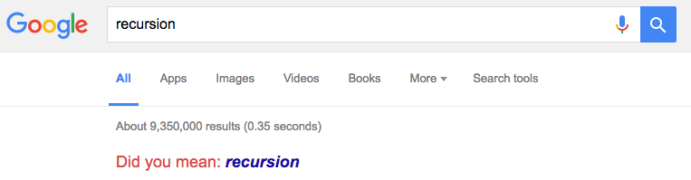

```{r setup, include=FALSE}
knitr::opts_chunk$set(echo = TRUE)
```

### On the Agenda

- Functions
    - How to write a function
    - When should we write them?
- Recursion
    - Defining something in terms of itself
    - Factorial Calculation ($n!$)
- Benchmarking
    - How fast are you going?
- Memoization
    - Caching function calls

# Functions

## Motivation

### Talking about a Function

Previously, we just wrote statements like:

```{r hello_world_func, eval = F}
cat("Hello World!")
```

within a main document. 

If we wanted to repeat that phrase elsewhere in the program, we would have to either:

1. Retype 
2. Copy and paste 

to the new location.

- This is **not** an ideal situation. 

### What is a Function?

**Definition:** A piece of code that performs a specified task that may or may not depend on parameters and it may or may not return one or more values. 


```{r, out.width = "150px", fig.retina = NULL, fig.align='center', echo = F, cache = T}
knitr::include_graphics("figures/function_machine.png")
```

### Why use a function?

Functions are great because:

1. The logic flow is chunked instead of a series of long statements
    - Also enables self-documenting depending on the function name. 
1. Decrease the probability of an error
    - Update the code in one central place instead of tracking multiple locations 
    - Easily reuse code across multiple analysis
    - No need to understand the internal computation.
1. Easier to share code with people that you collaborate.
    - Knowledge of what the function **does**
    - Parameters are established
    - Return information is known

### When should I use a function?

- The moment that you copy and paste more than a line of code within your analysis
    - This code should be within a function.
- If there is a possibility that you will need to reuse or call the same block of code at any point in time, it should be made into a function.

### Characteristics of a Good Function

When writing functions, its important to aim for having functions that have:

1. Intuitive Naming Scheme
    - Function name and parameters are clear as to their origins.
1. Solve a **single** problem.
    - Try to outsource logic so that each step of the problem can be analyzed.
1. Concise 
    - Taking many statements and wrapping it into a function should be *avoided*.

## Construction and Use

### Function Declaration and Calling

To declare the most simplistic function in R, you must use:

```{r, cache = T, eval = FALSE}
function_name = function ()  {
  # statements
}
```

To call the function, use:

```{r, cache = TRUE, eval = FALSE}
function_name()
```

### Function Declaration and Call Example

Here we opt to create a function that will by default say "Hello World!"

```{r}
hello_world = function() { # Function Declaration
  cat("Hello World!\n")    # Body Statement
}

hello_world()              # Call Function
```

Notes:

- The function is unable to receive user input. 
- Each time the function is called the same result will appear. 
- Thus, the function is **static**.

# Dynamic Functions

## Generalizations

### Dynamic Function Declaration 

Often times, we will need something more flexible to the ever changing needs of
the world. For a function to be flexible, we must add **arguments** to the function. 

There are two kinds of arguments:

- **Positional:** Order matters in the entry
- **Default Parameter :** Not necessary to specify a value for the parameter.

```{r cache = TRUE, eval = FALSE}
func_dynamic = function (parameter1, parameter2 = NULL)  {
  # body
}
```

In this case, `parameter1` is *positional* and `parameter2` is *default parameter*.

### Dynamic Function Declaration Call

We can then call the function with either:

```{r cache = TRUE, eval = FALSE}
# Specify both values
func_dynamic(parameter1, paramter2) 

# Parameter2 will use NULL as the value
func_dynamic(parameter1)  
```

### Dynamic Function Declaration and Call - Formatting Output

**Case Example:** Results need to look presentable and consistent throughout
a document. 

```{r format_percent, cache = T}
# Function Declaration
format_percent = function(x, digits = 3) {  # Define Func
  percent = round(x * 100, digits = digits) # Round digits
  result = paste0(percent, "%")             # Add % sign
  return(result)                            # Return
}
```

### Dynamic Function Declaration and Call - Formatting Output

To call the function, we can simply do:

```{r format_percent_call, cache = T}
x = runif(5)

format_percent(x)

format_percent(x, digits = 0)
```


### The Mystery of `return()`

One of the nice aspects of *R*, is you can avoid returning an object
via `return()` and simply just leave the name of the last variable.

e.g. 

```{r format_precent_no_return, cache = T}
format_percent = function(x, digits = 4){
 percent = round(x * 100, digits = digits)
 result = paste0(percent, "%")          
 result  # Last Result
}
```

This will save you *micro*seconds but increase your heartache.

### The Return Statement

\scriptsize
```{r return_example, cache = TRUE}
example_return = function(value = TRUE) {
 if(value) {
   return(TRUE)  # Clear
 } else {
   return(FALSE) # Clear
 }
}
```

```{r return_example_v2, cache = TRUE}
example_return = function(value = TRUE) {
 output = NULL
 if(value) {
   output = TRUE
 } else {
   output = FALSE
 }
 output           # Not Clear
}
```

### The Return Statement

As was shown, *R* is very lax when it comes to `return()`. By default, *R* will
return the last operation performed.

Whether you choose to use `return()` or not when designing a function is
ultimately a personal preference.

**Remarks:**

- Harder to read without the `return` statement
- Without a `return`, you must **not** add any statements after desired object.
- Might not be ideal to use `return` if the function is a one liner.

### Dynamic Function Declaration and Call - Formatting Output

Later, you may wish to add additional features to the function.

To do so, it is recommended that:

1. You use **default parameter** containing the unmodified value.
2. Make sure the function returns similar values.

```{r format_precent_sign, cache = T}
format_percent = function(x, digits = 4, psign = TRUE){  
  percent = round(x * 100, digits = digits) 
  
  if(psign){  # Check to see if % should be added
    result = paste0(percent, "%")
  } else {
    # Coerce to character to match % output.
    result = as.character(percent) 
  }
  return(result)
}
```

## Dynamic Function Declaration and Call - Linear Regression

Often, when working with linear regression, we want to compute three different summations to compute other useful diagnostic information:

- The Total Sum of Squares (TSS)
$$TSS = \sum\limits_{i = 1}^n { { {\left( { {y_i} - { {\bar y}_i} } \right)}^2} }$$
- Fitted Sum of Squares (FSS)
$$FSS = \sum\limits_{i = 1}^n { { {\left( { { {\hat y}_i} - \bar y} \right)}^2} }$$
- Residual Sum of Squares (RSS)
$$RSS = \sum\limits_{i = 1}^n { { {\left( { {y_i} - \hat y} \right)}^2} }$$

## Dynamic Function Declaration Example

Converting these statements to a function yields:

```{r fun_breaks, cache = TRUE}
compute_tss = function (y, y_bar)  {
  return(sum( (y - y_bar)^2 ))
}

compute_fss = function (y_hat, y_bar)  {
  return(sum( (y_hat - y_bar)^2 ))
}

compute_rss = function (y, y_hat)  {
  return(sum( (y - y_hat)^2 ))
}
```

### Dynamic Function Declaration and Call - Linear Regression

These summations have the following relationship:

$$\begin{aligned}
  TSS &= RSS + FSS \\
\sum\limits_{i = 1}^n { { {\left( { {y_i} - \bar y} \right)}^2} }  &= \sum\limits_{i = 1}^n { { {\left( { {y_i} - { {\hat y}_i} } \right)}^2} } + \sum\limits_{i = 1}^n { { {\left( { { {\hat y}_i} - \bar y} \right)}^2} } 
\end{aligned}$$

### Dynamic Function Declaration - Linear Regression

Exploiting the previously made functions with the aforementioned relationship, we get:

```{r tss_rel, cache = TRUE}
tss_relationship = function (y, y_hat, y_bar)  {
  rss = compute_rss(y, y_hat)
  fss = compute_fss(y_hat, y_bar)
  tss = rss + fss
  return( tss )
}
```

### Dynamic Function Call - Linear Regression

**Setup Function Calls:**
  
\scriptsize
```{r data_setup, cache = TRUE}
# Number of Observations
n = 10
# Generate x
x = seq(0, 1, length.out = n)

# Generate random y
# Set seed for reproducibility
set.seed(114)
y = runif(n)

# Calculate mean
y_bar = mean(y)

# Obtain y_hat
y_hat = lm(y~x)$fitted.values
```

### Dynamic Function Call - Linear Regression

**Call the functions:**

```{r computations, cache = T}
# Compute
rss = compute_rss(y, y_bar)
fss = compute_fss(y_hat, y_bar)
tss = compute_tss(y, y_bar)
tss_v2 = tss_relationship(y, y_hat, y_bar)

# Verify equality
all.equal(tss, tss_v2)
```


### Variable Scope in a Function

Within a function's `{}`, *R* uses the defined variables within that region.

```{r, eval = F, cache = T}
# Note `value` has not been defined.
multiple_constant = function(x) { 
  return(value * x)
}

# Only on call is an error detected.
multiple_constant(5)
## Error in multiple_constant(5) :
## object 'value' not found
```

**Note:** *R* always gives you the benefit of the doubt because it _cares_. This
sometimes can lead to bad results...

### Function vs. Global Variable Scope

If a variable is not found, it will search the global environment.

```{r test_case, eval = T, cache = T}
# Define value in global environment
# (e.g. outside of the function)
value = 3

multiple_constant = function(x) { 
  # `value` is not been defined in the function.
  return(value * x) 
}

multiple_constant(5)
```

**Note:** This behavior can be very problematic. Try to keep your scope limited.

### Summary of Functions

- Talked about the steps to creating a function.
- Explored ideal function designs.
- Acknowledged R's environment scoping habits.


### What is Recursion?

**Definition:** Defining a process that is in terms of itself such that the problem is able to be *simplified* and *delegated* in a reduced state.

```{r, out.width = "250px", fig.retina = NULL, fig.align='center', echo = F, cache = T}

```

- Search [Google for Recursion](http://www.google.com/search?q=recursion) and try to click on the "Did you mean: *recursion*" part.

### What is Recursion? (Loosely Stated)

Loosely, recursion can be considered in the following light:

- If a problem is easy to solve enough, then simply solve it.
- Else, reduce the problem so that there is *one or more simpler versions* of the **same problem** and try to solve them.


### Example of Recursion

Consider the objective of going to [**Illini Hall**](https://www.google.com/maps/place/Illini+Hall,+725+S+Wright+St,+Champaign,+IL+61820/@40.1094428,-88.2314462,17z/data=!3m1!4b1!4m5!3m4!1s0x880cd73f088353ff:0x8d73968b31810cf9!8m2!3d40.1094428!4d-88.2292575).

Let's define a function called "Travel to Illini Hall" and implement it recursively.

1. If you are in Illini Hall, stop.
2. Ask a random person where Illini Hall is and move in the direction suggested until you are unsure.
3. Travel to Illini Hall

### Properties of a Recursive Function

Inorder for a function to be recursive, it must have the following:

1. **Base Case**
    - Condition to stop
    - Also, the **simpliest** solution to the problem.
2. **Work** toward **Base Case**
    - Make the problem simplier
3. **Recursive Call**
    - Call to itself

### Power function

Another example of recursion would be that of the **power function** that acts to simplify repetitve multiplication of one object.

\[\begin{aligned}
  {x^k} &= x \cdot {x^{k - 1} } \\
   &= x \cdot x \cdots x \\
   &= \prod\limits_{i = 1}^k x\\ 
\end{aligned} \]

### Power Function with Loops

This behavior can easily be modeled using a loop:

```{r pow_loop, cache = T}
pow_loop = function(x, n){ # Define function
  
  result = 1               # Setup output variable
  
  for(i in seq_len(n)){    # Loop over the power
    result = result*x
  }
  
  result                   # Return the result
}
```

**Note:** This implementation does *not* support negative exponents!

### Power Function with Recursion

However, we're more interested in recursively defining the function.

That is, we want to define the power function in terms of *itself*. 

```{r pow, cache = T}
pow = function(x, n){ # Define function
  
    if (n <= 0){      # Set a base case
      return(1)       # No recursive call
    } 
    
    # Solve a small part of the larger problem
    return(x * pow(x, n - 1)) # Call ourself
}
```

**Note:** This implementation does *not* support negative exponents!

### Behind the Scenes of the Power Function in R

What we are saying in this particular case is that:

- `pow(x, n) = x*pow(x, n - 1)`

So that, if `pow(2,5)`, we have:

- `pow(2,5)` is equal to `x * pow(2,4)`
- `pow(2,4)` is equal to `x * pow(2,3)`
- `pow(2,3)` is equal to `x * pow(2,2)`
- `pow(2,2)` is equal to `x * pow(2,1)`
- `pow(2,1)` is equal to `x * pow(2,0)`
- `pow(2,0)` is equal to `1`

That is, we have broken down each of the multiplications (components) to obtain the power. The key to the recursion is the last stage of the problem where we invoke the base case to stop the recursion.

### Viewing Recursion from a Functional Perspective

```{r test_example, cache = T}
pow = function(x, n, d){ # Define function
    # Add a tracer into the function
    spacer = ""; 
    for (i in seq_len(d)) {
        spacer = paste0(spacer, " ", collapse = "")
    }
    cat(spacer, "pow(",x,",",n,")\n", sep="")

    # --------- Same code as before
    
    if (n <= 0){       # Set a base case
      return(1)       # No recursive call
    } 
    
    # Solve a small part of the larger problem
    return(x * pow(x, n - 1, d + 4)) # Call ourself
}
```

### Viewing Recursion from a Functional Perspective - Output

```{r tracer_output, cache = T}
cat(pow(7, 2, 0))
```


### Factorials

A more useful recursive function is that of a **factorial**.

Factorials are given by:

$$\begin{aligned}
  n! &= n \cdot \left( {n - 1} \right)!  \\
   &= n\left( {n - 1} \right)\left( {n - 2} \right) \cdots 3 \cdot 2 \cdot 1  \\
   &= \prod\limits_{i = 1}^n i   \\ 
\end{aligned}$$

**Note:** Consider viewing [Proofs of the Gamma distribution](http://thecoatlessprofessor.com/statistics/proofs-of-gamma-distribution/) to understand the recursive nature of the Gamma function for integers $n! = \Gamma \left( {n + 1} \right)$

### Use cases

**Factorials** are commonly used in Combinatorics for:

- **Permutations:** Order of selection matters without replication

\[P\left( {n,k} \right) = \frac{ {n!} }{ {\left( {n - k} \right)!} }\]

- **Combinations:** Order of selection does not matter without replication

$$\begin{aligned}
C\left( {n,k} \right) &=\left( \begin{gathered}
  n  \\
  k  \\ 
\end{gathered}  \right) \\
&=  \frac{ {P\left( {n,k} \right)} }{ {P\left( {k,k} \right)} } \\
&= \frac{ {n!} }{ {k!\left( {n - k} \right)!} }
\end{aligned}$$

### Factorial

Here is a custom implementation of the factorial function:

```{r}
factorial_r <- function(x){    # Function Definition
  if(x <= 1){
    return(1)
  } else {
    return(x*factorial_r(x-1))
  }
}
```

- Identify the 3 parts of the recursive algorithm

**Note:** Factorials in *R* are given by the `factorial(x)` function and not `x!` (Why?)

### Misc note on Recursion

- Examples provided deal with **tail** recursion.
    - That is, the last statement of the function is calling itself.
- Only **tail** recursion can be converted to using **loops**.
- **Avoid**, like the plauge, using **global variables** with recursion.

### Summary on Recursion

- Recursive functions call themselves
- Recursion exists in everyday statistics


# Benchmarking

## Why Benchmark?

### Code Implementations

- There are many ways to implement an idea.. 
    - The question is: 
    -  What implementation is the best?

### Benchmark

To answer what implementation works the best, one needs to employ a benchmark to obtain **quantifiable results**.

Benchmarks are an ideal way to quantify how well a method performs because it has the ability to:

1. Show the amount of time the code has been running
2. Bottlenecks
3. Sloppy coding

Plus, it appeals to our quest for data driven decisions.

## Strategies for Writing Benchmarks

### A Note on Benchmarks..

Benchmarks are like a microscope. 


```{r, out.width = "150px", fig.retina = NULL, fig.align='center', echo = F, cache = T}

```

Magnification is able to be adjusted... But what are you really observing?

The truth? Or just a clever lie?

### Writing a Benchmark

Benchmarks can be very tempting to use to solely make decisions. 

However, in order for the benchmark to be beneficial, the benchmark must be done properly.


### Properly Writing a Benchmark 

To ensure the code is properly time benchmarked, do the following:

1. Only have R open
1. Do not use the computer while the benchmark is active.
1. Warm up code prior to benchmarking (code will be "hot" during benchmark)
1. Have enough replications (N = 100)
1. Fix the data used per replication (e.g. same seed)
1. Check code provides same output

With this being said, let's create one (or two) to see how it works!

### The Simpliest Benchmark

The simpliest benchmark is given with R's built in `system.time()` function.

The key time is the "elapsed" time as it is the summation of the others.

```{r simple_benchmark, cache = TRUE}
out = system.time({Sys.sleep(1)})
out

out[3]
```

**Note:** Adding, removing, or modifying a variable will impact the timing!

## Benchmarking Case Study

### Setting the Stage

In this case, we are going to be interested in two ideas:

1. The cost of operating on a `matrix` vs. a `dataframe`.
2. The cost of using () vs {}. (Credit to [Dirk Eddelbuettel](http://dirk.eddelbuettel.com/blog/2011/04/12/))

### Setting the Stage

For the first benchmark case, we are going to create the following objects:

```{r benchmark_data_structure, cache = TRUE}
# Set seed for reproducibility
set.seed(1337)

# Construct large matrix object
matrix.op = matrix(rnorm(10000*100), 10000, 100)

# Convert matrix object to data.frame
dataframe.op = as.data.frame(matrix.op)
```


### Cost of using Parentheses vs. Curly Brackets

```{r benchmark_brackets, cache = TRUE}
# Different R implementations
f = function(n, x=1) for (i in 1:n) x=1/(1+x)
g = function(n, x=1) for (i in 1:n) x=(1/(1+x))
h = function(n, x=1) for (i in 1:n) x=(1+x)^(-1)
j = function(n, x=1) for (i in 1:n) x={1/{1+x} }
k = function(n, x=1) for (i in 1:n) x=1/{1+x}
```


### Cost of using Parentheses vs. Curly Brackets

To illustrate the benefits of compiler vs. interpreter, we're also going to call
upon C++ using Rcpp.

Do not worry about understanding the code presented next... 

```{r benchmark_rcpp_brackets, cache = TRUE}
# Load Rcpp
library(Rcpp)

# Define a version in C++ called 
cppFunction(code='int d(int n, double x = 1.0){
                  for (int i=0; i<n; i++) x=1/(1+x);
                  return x;
                  }')
```

### R Package: `rbenchmark`

The `rbenchmark` R package provides a way to obtain the total amount of time
elapsed for a given piece of code run over $N$ replications.

The benchmark is initiated by:

```{r demo_benchmark, eval=FALSE, cache = TRUE}
# Load Library
library('rbenchmark')

# Run benchmark
benchmark(testfun1 = somefun(),
          testfun2 = otherfun())
```

### R Package: `rbenchmark`

The results returned are:

- The user, system, and total elapsed times for the active R process
- The cumulative sum of user and system times of any child processes spawned by
  it on which it has waited. (*.child, *.self)


### R Package: `rbenchmark` - Case 1

```{r benchmark_demo_data_structure, cache = TRUE}
# Load Library
library('rbenchmark')

# Run benchmark
out = benchmark(mat.op = apply(matrix.op, 2, sd), 
                df.op = apply(dataframe.op, 2, sd))

```

```{r op_out_benchmark, cache = TRUE, eval = FALSE}
# Table Object
out
```

```{r op_out_benchmark_table, cache = TRUE, echo = FALSE}
knitr::kable(out, digits = 2, row.names = F)
```

```{r benchmark_demo_data_structure_avg_time, cache = TRUE}
# Average time spent per iteration
out[,"elapsed"]/out[,"replications"]
```

### R Package: `rbenchmark` - Case 2

```{r benchmark_demo_curly_paran, cache = TRUE, size='scriptsize'}
N = 1e6 # Number of Times to Run Loop
out = benchmark(f(N, 1), g(N, 1), h(N, 1), j(N, 1), k(N, 1), d(N, 1), # Test Funcs
          columns = c("test", "replications", "elapsed", "relative"), 
          order="relative",  # Order the results by speed (lower is better)
          replications=20)   # Number of runs for each function
```

```{r benchmark_demo_curly_paran_sum_obj, cache = TRUE, echo = FALSE, eval = FALSE}
out
```

```{r benchmark_demo_curly_paran_sum, cache = TRUE, echo = FALSE}
knitr::kable(out)
```

### R Package: `rbenchmark` - Case 2

The average amount of time a replication takes can be obtained via:

```{r cache = T}
out[,"elapsed"] / out[,"replications"]
```

### Drilling down with `microbenchmark`

- The `microbenchmark` R package provides a way to record time for each iteration unsummed! 
     - This provides more magnification on functions than `rbenchmark`.

- To use `microbenchmark` do the following:

```{r demo_microbenchmark, cache = TRUE, eval=FALSE}
# Load Library
library('microbenchmark')

# Run benchmark
microbenchmark(testfun1 = somefun(), # List Functions
               testfun2 = otherfun(), 
               times = 100) # Number of Replications
```

**Note:** This is not ideal for large functions. This is meant for pinpoint precision of elements.

### Drilling down with `microbenchmark` - Case 1

```{r demo_microbenchmark_data_structure, cache = TRUE}
# Load Library
library('microbenchmark')

# Run benchmark
out = microbenchmark(mat.op = apply(matrix.op, 2, sd), 
                     df.op = apply(dataframe.op, 2, sd))

```

```{r demo_mb_data_structure_table, cache = T, eval = F}
# Table Object
summary(out)
```

```{r demo_mb_data_structure_table_render_kable, cache = T, echo = F}
knitr::kable(summary(out), digits = 2)
```

### Drilling down with `microbenchmark` - Case 2

```{r demo_microbenchmark_curly_paran, cache = TRUE}
N = 1e6 # Number of Times to Run Loop
out = microbenchmark(f(N, 1), g(N, 1), h(N, 1), # Funcs
                     j(N, 1), k(N, 1), d(N, 1),
                     times = 20)   # Number of Reps
```

```{r demo_microbenchmark_curly_paran_table, cache = TRUE, eval = FALSE}
summary(out) # Obtain quantile information
```

```{r demo_mb_curly_paran_table_render, cache = TRUE, echo = FALSE}
knitr::kable(summary(out), digits = 2)
```


### Visualization using `microbenchmark` and `ggplot2`

```{r compare_ggplot2, cache = TRUE, fig.height=2, fig.width=5}
library(ggplot2)
autoplot(out)   # Creates a violin plot of the data
```


### Summary of Benchmarking

- Covered usage reasons for benchmarking code
- Discussed areas of concern for obtaining benchmarks.


# Memoization

## Functional Caches

### Caching Values is Memoization

One of the common themes of this course is caching or storing values to be reused later during a computation.

- This is exactly the definition of **memoization**. 

- Memoization is key to a lot of intense statistical computations. [A recent entry on this can be found as a response to a question on StackOverflow](http://stackoverflow.com/a/36973875/1345455).

### Memoization in Depth

The goal of memoization is to cache function results under given parameters and reuse them at a later time. 

- To cache the value of the computation, a key is created that relates the function and the parameters used within it. 
- Thus, after one calculation under the given parameters the function no longer needs to recalculate the same result again if called for any other sequence in the computation. 
- The reason why is the result can just retrieve the value from the cache. 

**Note** This is particularly relevant for the recursive structure set up.

### Memoization in R

- Hadley Wickham, Jim Hester, and Kirill Müller have created phenomenal package called [`memoise`](https://cran.r-project.org/web/packages/memoise/index.html).

- The package brings in the ability to memoization functions with very little work.
    - You just need to be wary of the cache!

## Case Study: Fibonacci

### Fibonacci Sequence

The Fibonacci Sequence is a famous series that traditionally looks like so:

$$1, 1, 2, 3, 5, 8, 13, 21 $$

The mathematical formulation is known as: 

$$ F\left( n \right) = F\left( {n - 1} \right) + F\left( {n - 2} \right)$$

where $F(1) = 1$ and $F(2) = 1$.

### Example Fibonacci Sequence

We can write the Fibonacci Sequence like so:

```{r fib}
fibonacci = function(n) {
   if (n <= 2) {
     return(1)
   }
  
   return(fibonacci(n-2) + fibonacci(n-1))
}
```


### Fibonacci Sequence in an Image

```{r, cache = T, echo = F}
library("ggplot2")
d = data.frame(Fibonacci = sapply(1:10, fibonacci),
               N = 1L:10L)

ggplot(d, aes(N, Fibonacci)) + geom_line() + geom_point() +
  scale_x_continuous(labels = function (x) floor(x))
```

### Example Memoization

To memoize the Fibonacci function, we need to wrap place the function name in `memoise()`

```{r mem_example, cache = TRUE}
library("memoise")
mem_fib = memoise(fibonacci)
```

We then refer to the memoized function just like normal previously, e.g. 

```{r mem_ized, cache = TRUE}
fibonacci(5) # Normal
mem_fib(5)   # Memoized
```

## Internal vs. External

### A Word on the Memoization Cache

In this case, the memoization will only apply to the top level function call. 

So, the results obtained via `mem_fib(34)` will not effect `mem_fib(35)`.

```{r mem_ized_fib, cache = TRUE}
system.time({mem_fib(34)}) # First time calculation
system.time({mem_fib(35)}) # First time calculation
```

### Internal Memoization Cache

To access the cache the in-between levels, you will need to declare the memoization function name within the function. e.g. 

```{r memized_fib_v2, cache = TRUE}
internal_mem_fib = memoise(function(n) { 
  if (n <= 2){
    return(1)
  }
  
  # Note the reference to the outside declaration
  return(internal_mem_fib(n - 2) + internal_mem_fib(n - 1))
})
```

### Benchmarks

When we write it this way, we gain speed due to the cache given by memoization being used. e.g.

```{r memoized_v2, cache = T}
system.time({mem_fib(25)}) # Registers value in map
system.time({mem_fib(25)}) # Extracts value from map
system.time({internal_mem_fib(25)}) # Built in Memoization
```

### Clear the Cache

To remove the memoization, use `forget()`

```{r memized_cache, cache = TRUE}
forget(mem_fib)
forget(internal_mem_fib)
```

**Note:** You will have to redeclare the memoization again with `memoise()`


### Summary of memoization

- Memoization is used as a short term memory bridge that speeds up the calculation.
- Be wary of the cache! Are you using an internal or external cache?
