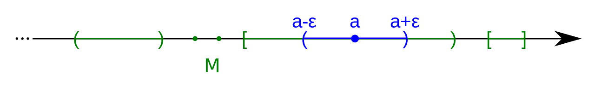

```{r setup, include=FALSE}
knitr::opts_chunk$set(echo = FALSE)
```

### Administrative

- HW1 grades should be released tomorrow (Wednesday)
- **HW2 is due on Sunday, July 2nd @ 11:59 PM**
- Extra OH on Thursday in IH 122 from 12 - 1 PM.

# Numerical Stability

## Variance Estimation

### Computational Statistics and the Variance Estimator

- **Computational Statistics**, the red-headed step child between statistics and computer science, has worked time and time again to obtain an algorithm for calculating *variance*.
- Yes, **variance** given by:

$$\begin{aligned}
  {\sigma ^2} &= E\left[ {{{\left( {X - E\left[ X \right]} \right)}^2}} \right] \\
   &= \frac{1}{n}\sum\limits_{i = 1}^n {{{\left( {{x_i} - \bar x} \right)}^2}} \text{  *} \\ 
\end{aligned}$$

*Discrete Case Representation

### Why is the algorithm for variance complicated? 

Consider the definitions of **Mean** and the **Variance**:

$$\begin{aligned}
\bar{x} &= \frac{1}{n}\sum\limits_{i = 1}^n { {x_i} } \\
{\sigma ^2} &= \frac{1}{n}\sum\limits_{i = 1}^n { { {\left( { {x_i} - \bar{x}} \right)}^2} }
\end{aligned}$$

Note that the algorithm for the variance relies upon a version of the "Sum of Squares", e.g.

$$\begin{aligned}
{S_{xx} } &= \sum\limits_{i = 1}^n { { {\left( { {x_i} - \bar x} \right)}^2} } \\
{\sigma ^2} &= \frac{1}{n}{S_{xx} }
\end{aligned}$$


### History of the Sum of Squares

- **Sum of Squares** (*SS*) provides a measurement of the total variability of a data set by squaring each point and then summing them. 
- As we have seen, *SS* appears during linear regression and ANOVA with the forms of *TSS*, *FSS*, and *RSS*. 

### (Uncorrected) Sum of Squares


- In an "uncorrected" ANOVA table, where the intercept is considered a source, we have the **Total Sum of Squares (TSS)** given as:

$$TSS = \sum\limits_{i = 1}^n {y_i^2}$$
\footnotesize

```{r anova_uncorrected, cache = TRUE}
anova_uc = data.frame(Source = c("Intercept", "Fitted", "Residual", "Total"), 
                      DF     = c("$1$","$p-1$","$n-p$","$n$"),
                      SS     = c("$n{ {\\bar Y}^2}$","$\\sum\\limits_{i = 1}^n { { {\\left( { { {\\hat y}_i} - \\bar y} \\right)}^2} }$","$\\sum\\limits_{i = 1}^n { { {\\left( { {y_i} - { {\\hat y}_i} } \\right)}^2} }$","$\\sum\\limits_{i = 1}^n {y_i^2}$"))

knitr::kable(anova_uc, align = c("l","c","l"), caption = "Uncorrected ANOVA Table")
```

### (Corrected) Sum of Squares

- More often, we use the **Corrected Sum of Squares**, which compares each data point to the mean of the data set to obtain a deviation and then square it.

$$TSS = \sum\limits_{i = 1}^n { { {\left( { {y_i} - \bar y} \right)}^2} }$$

\footnotesize

```{r anova_corrected, cache = TRUE}
anova_c = data.frame(Source = c("Fitted", "Residual", "Total"), 
                      DF     = c("$p-1$","$n-p$","$n-1$"),
                      SS     = c("$\\sum\\limits_{i = 1}^n { { {\\left( { { {\\hat y}_i} - \\bar y} \\right)}^2} }$","$\\sum\\limits_{i = 1}^n { { {\\left( { {y_i} - { {\\hat y}_i} } \\right)}^2} }$","$\\sum\\limits_{i = 1}^n { { {\\left( { {y_i} - \\bar y} \\right)}^2} }$"))

knitr::kable(anova_c, caption = "Corrected ANOVA Table")
```


### Why do we use the corrected Sum of Squares?

- In any case, when we talk about Sum of Squares it will always be the *corrected* form.

- The question for today:

**Why** is this approached preferred computationally?

## Overflows

### Calculating Sum of Squares for One Point

Using the Uncorrected vs. the Corrected Sum of Squares definition would yield:

```{r overflow_integer, cache = TRUE, echo = TRUE}
(x = (1.0024e6)^2)               # Uncorrected
(y = (1.0024e6 - 1.0000156e6)^2) # Corrected
```

### Imagine There's More than One Point

Now, consider applying both of the definitions over a sequence of $n$ points
and summing the results. 

- Which definition might lead to a computational issue?

```{r overflow_integer_v2, cache = TRUE, echo = FALSE}
```

### Arithmetic Overflow

In the case of the uncorrected version, it is sure to cause
an **arithmetic overflow** when working with large numbers.

If we were to add to `x`, we would hit *R*'s 32-bit integer limit (see `?integer`):

```{r max_integer, cache = TRUE, echo = TRUE}
.Machine$integer.max  # Maximum integer in memory
```


### Arithmetic Overflow - Behind the Scenes

*R* > 3.0, will try to address this behind the scenes by automatically
converting the `integer` to a `numeric` with precision:

```{r max_double, cache = TRUE, echo = TRUE}
.Machine$double.xmax  # Maximum numeric in memory
```

### Arithmetic Overflows and Big Data

- Within *Big Data* this problem may be more transparent as the information
  summarized is larger.

- Thus, you may need to use an external package for very big numbers. 
  I would recommend the following:
    - [`Rmpfr`](https://CRAN.R-project.org/package=Rmpfr)
    - [`gmp`](https://CRAN.R-project.org/package=gmp)
    - [`bit64`](https://CRAN.R-project.org/package=bit64/)

## Theory of Estimators 

### Forms of the Variance Estimator

- Two-Pass Algorithm Form:

\[{\sigma ^2} = \frac{1}{n}\sum\limits_{i = 1}^n { { {\left( { {x_i} - \bar x} \right)}^2} } \]

- Naive Algorithm Form:

\[{\sigma ^2} = \frac{ {\sum\limits_{i = 1}^n {x_i^2}  - { {\left( {\sum\limits_{i = 1}^n { {x_i} } } \right)}^2}/n} }{n}\]


### Sum of Squares Manipulation for Naive version

I'm opting to simply show the $S_{xx}$ modification instead of working 
with $\sigma ^2$ since it just scales the term by $1/n$.

$$\begin{aligned}
  S_{xx} &= \sum\limits_{i = 1}^n { { {\left( { {x_i} - \bar x} \right)}^2} } & \text{Definition} \notag \\
   &= \sum\limits_{i = 1}^n {\left( {x_i^2 - 2{x_i}\bar x + { {\bar x}^2} } \right)} & \text{Expand the square}  \notag \\
   &= \sum\limits_{i = 1}^n {x_i^2}  - 2\bar x\sum\limits_{i = 1}^n { {x_i} }  + { {\bar x}^2}\sum\limits_{i = 1}^n 1 & \text{Split Summation} \notag \\
   &= \sum\limits_{i = 1}^n {x_i^2}  - 2\bar x\sum\limits_{i = 1}^n { {x_i} }  + \underbrace {n{ {\bar x}^2} }_{\sum\limits_{i = 1}^n c  = n \cdot c} & \text{Separate the summation} \notag \\
\end{aligned}$$

### Sum of Squares Manipulation for Naive version - Cont.

$$\begin{aligned}
  S_{xx}   &= \sum\limits_{i = 1}^n {x_i^2}  - 2\bar x\left[ {n \cdot \frac{1}{n} } \right]\sum\limits_{i = 1}^n { {x_i} }  + n{ {\bar x}^2}  & \text{Multiple by 1} \notag \\
   &= \sum\limits_{i = 1}^n {x_i^2}  - 2\bar xn \cdot \underbrace {\left[ {\frac{1}{n}\sum\limits_{i = 1}^n { {x_i} } } \right]}_{ = \bar x} + n{ {\bar x}^2}& \text{Group terms for mean}  \\
   &= \sum\limits_{i = 1}^n {x_i^2}  - 2\bar xn\bar x + n{ {\bar x}^2} & \text{Substitute the mean} \notag \\
   &= \sum\limits_{i = 1}^n {x_i^2}  - 2n{ {\bar x}^2} + n{ {\bar x}^2} & \text{Rearrange terms} \notag \\
   &= \sum\limits_{i = 1}^n {x_i^2}  - n{ {\bar x}^2} & \text{Simplify} \\ 
\end{aligned}$$

## Variance Implementations

### Implementing Naive Variance

```{r var_algo_naive, cache = TRUE, echo = TRUE}
var_naive = function(x){
  n = length(x)           # Obtain the length
  sum_x = 0               # Storage for Sum of X
  sum_x2 = 0              # Storage for Sum of X^2
  for(i in seq_along(x)){ # Calculate sums
    sum_x = sum_x + x[i]
    sum_x2 = sum_x2 + x[i]^2
  }
  
  # Compute the variance
  v = (sum_x2 - sum_x*sum_x/n)/n
  return(v)
}
```

## Implementing Two-Pass Variance

```{r var_algo_2p, cache = TRUE, echo = TRUE}
var_2p = function(x){
  n  = length(x)           # Length
  mu = 0; v = 0            # Storage for mean and var
  
  for(i in seq_along(x)){  # Calculate the Sum for Mean
    mu = mu + x[i]         
  }
  
  mu = mu / n              # Calculate the Mean
  
  for(i in seq_along(x)){  # Calculate Sum for Variance
    v = v + (x[i] - mu)*(x[i] - mu)
  }
  
  v = v/n                  # Calculate Variance
  return(v)                # Return
}
```

### Calculations

```{r example_break, cache = TRUE, echo = TRUE}
set.seed(1234) # Set seed for reproducibility
x = rnorm(2e6, mean = 1e20, sd = 1e12)

(method1 = var_naive(x))
(method2 = var_2p(x))
(baser = var(x)*((2e6)-1)/(2e6))

all.equal(method1, method2)
all.equal(method2, baser)
```


### *R*'s Implementation

*R* opts to implement this method using a two-pass approach.

- [Check out the source here](https://github.com/wch/r-source/blob/e5b21d0397c607883ff25cca379687b86933d730/src/library/stats/src/cov.c#L206-L550)
- There are quite a few papers on this topic going considerably far back. See [Algorithms for Computing the Sample Variance: Analysis and Recommendations (1983)](http://www.jstor.org/stable/2683386?seq=1#page_scan_tab_contents) 

# Comparing Numbers

## Precision

### $1 + 1 \neq 2$

Computers in all their infinite wisdom and ability are not perfect. One of the
limiting areas of computing is handling **numeric** or **float** data types.

```{r numeric_example, cache = TRUE, echo = TRUE}
x = 0.1
x = x + 0.05
x
if(x == 0.15){
  cat("x equals 0.15")
} else { 
  cat("x is not equal to 0.15")
}
```

**Why isn't `x` equal to 0.15!?**


### 


[](https://www.youtube.com/v/Aq_1l316ow8?start=0&end=21)


### Enter: Numerical Stability

In essence, *R* views the two numbers differnetly due to rounding error during the computation:

```{r numeric_string, cache = TRUE, echo = TRUE}
sprintf("%.20f", 0.15) # Formats Numeric
sprintf("%.20f", x)    
```

### $\epsilon$ neighborhood 

Specifically, we are hitting a machine tolerance fault given by an $\epsilon$ neighborhood.

```{r epsilon_neighborhood, out.width = "250px", fig.retina = NULL, fig.align='center', echo = F, cache = T}

```

The value of the $\epsilon$ is given by:

```{r machine_eps_neighborhood, cache = TRUE, echo = TRUE}
.Machine$double.eps
```

This gives us the ability to compare up to `1e-15` places accurately.

```{r eps_example, cache = TRUE, echo = TRUE}
sprintf("%.15f", 1 + c(-1,1)*.Machine$double.eps)
```

### Discrete Solution Check

To get around rounding error between two objects, we add a tolerance parameter to check whether the value is in the $\epsilon$ neighborhood or not.

```{r all_equal_example, cache = TRUE, echo = TRUE}
all.equal(x, 0.15, tolerance = 1e-3)
```


### Discrete Solution Check

Since `all.equal` may not strictly return `TRUE` or `FALSE`, it is highly advisable to wrap it in `isTRUE()`, e.g.

```{r is_true_value, cache = TRUE, echo = TRUE}
isTRUE(all.equal(x, 0.15))
```

Thus, in an `if` statement, you would use:
```{r is_true_numeric, cache = TRUE, echo = TRUE}
if(isTRUE(all.equal(x, 0.15))){
  cat("In threshold")
} else {
  cat("Out of threshold")
}
```

## Case Study: Decimal Index

### Bad Loop

To magnify the issue consider a loop like so:

```{r bad_loop_example, cache = TRUE, echo = TRUE, eval = FALSE}
inc_value = 360L / 14L # Value to increment
i = 0                  # Increment storage
while(i != 360){       # Loop
  i = i + inc_value    # Add values
}
```

After 14 iterations, the loop should complete, but it does *not*! In fact, this loop will go onto infinity.

### Good Loop

To fix the looping issue, we opt to always stick with *integer*s as counters

```{r good_loop_example, cache = TRUE, echo = TRUE}
inc_value = 360 / 14 # Value
i = 0L               # Integer
o = 0                # Numeric
while(i != 14L){
  o = o + inc_value  # Sum
  i = i + 1L         # Increment loop
}
i
```


### Summary

- Statistics and Computer Science rely on each greatly in this Brave New World of Data Science.
- When working with big numbers, understand that arithmetic overflow is a reality.
- **Never, ever, ever** use a floating-point representation as an incrementor for a loop. 
    - Always use an `integer` for an incrementor and then convert it to a `numeric` within a function.
- This topic **will** come up again when we switch to using `Rcpp`.
