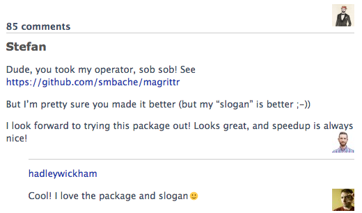
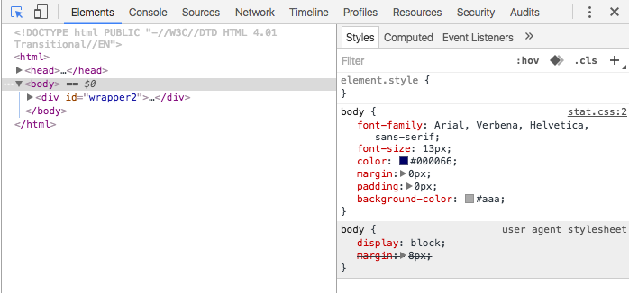
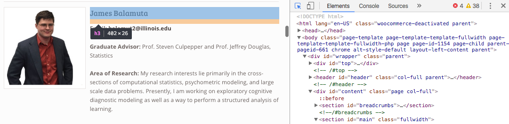
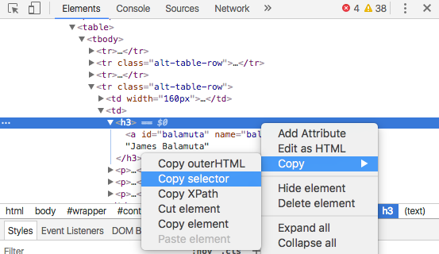

```{r }
---
title: "Piping and Webscrapping"
short-title: "Piping and Webscrapping"
author: "James Balamuta"
short-author: "J Balamuta"
date: '`r format(Sys.Date(), "%B %d, %Y")`'      # Month DD, YYYY (Main Slide)
short-date: '`r format(Sys.Date(), "%m/%d/%Y")`' # MM/DD/YYYY (Lower Right)
institute: "University of Illinois at Urbana-Champaign"
short-institute: "UIUC"
department: "Department of Informatics, Statistics"           # Institute must be defined
license: "CC BY-NC-SA 4.0, 2016 - 2017, James J Balamuta"
section-titles: true                             # Provides slide headings
safe-columns: true                               # Enables special latex macros for columns.
output: 
   uiucthemes::beamer_illinois
---

```{r setup, include=FALSE}
options(width = 60)
knitr::opts_chunk$set(echo = TRUE, cache = TRUE)
```

```{r, echo = F, message=F, cache = FALSE}
library("magrittr")
```

### On the Agenda

- Piping Operator
    - Motivation
    - History
    - Details `%>%`
- Web Scrapping
    - Understanding Document Object Model
    - Using `rvest`

# Piping 

## History

### History of the Piping Operator

The piping operator has existed in many forms over the years...

- Shell/Terminal: Pass command from one to the next with [pipeline character `|`](https://en.wikipedia.org/wiki/Pipeline_(Unix)). 
- `F#`: [Forward pipe operator `|>`](https://msdn.microsoft.com/en-us/visualfsharpdocs/conceptual/symbol-and-operator-reference-%5Bfsharp%5D) and served as the motivation for *R*'s.
- `Haskell`: Contains [many piping operations](https://wiki.haskell.org/Keywords) derived from shell/terminal. 
- `Python`: **Lacks** a similar implementation to *R*'s. The closest after
4 years appears to be in the [toolz module](https://toolz.readthedocs.io/en/latest/api.html#toolz.functoolz.pipe).
- `R`: [Stefan Milton Bache](http://stefanbache.dk/) created `%>%` in the [magrittr](https://github.com/smbache/magrittr) package.
    - Unbeknowist to Hadley, he introduced this functionality via `%.%` in his rewrite of `plyr` called
`dplyr` to which Stefan famously replied... 

### Origins of the Pipe Operator in R

```{r pipe_op_rstudio, out.width = "250px", fig.retina = NULL, fig.align='center', cache = TRUE, echo = FALSE}

```

[Stefan Milton Bache](http://stefanbache.dk/) commenting on Hadley's [Introducing `dplyr`](https://blog.rstudio.org/2014/01/17/introducing-dplyr/) post on the [RStudio Blog](https://blog.rstudio.org/).

### Remember

```{r pipe_op, out.width = "250px", fig.retina = NULL, fig.align='center', cache = TRUE, echo = FALSE}
knitr::include_graphics("img/MagrittePipe.jpg")
```

In English: **This is not a pipe**. Follows from [René Magritte's The Treachery of Images](https://en.wikipedia.org/wiki/The_Treachery_of_Images)

## Background 

### Present Day...

Up till now, if we wanted to have step-wise operations on reading data in we 
would need to do:

```{r stepwise_read, eval = FALSE}
input_data = read.csv('/path/to/data.csv')
subset_data = subset(input_data, treatment > 10)
top_20_data = head(subset_data, 20)
```

Under this approach, we have successfully littered the global environment
with tons of variables that have a one time only use.

### Long and painful...

To get around that, we can embed the function
calls. 

```{r embedded_call, eval = FALSE}
top_20_data = head(
                   subset(
                          read.csv('/path/to/data.csv'),
                          treatment > 10),
                 20)
```

Though, that doesn't look very nice and the logic is *hard* to follow...

## magrittr

### Enter the Pipe Operator

To simplify the process, we opt ot use a *pipe* operator defined as `%>%` in 
the [`magrittr` package](https://cran.r-project.org/web/packages/magrittr/vignettes/magrittr.html).

Examples:

- `x %>% rfunction`
    - Same as `rfunction(x)`
- `x %>% rfunction(arg = value)`
    - Same as `rfunction(x, arg = value)`

## Examples 

### Piping is Sequential Logic

Take for example ordering a Starbucks drink via Mobile Order:

> find drink, select store, order, go to store, pick up coffee.

```{r compressed_r_starbucks, eval = FALSE}
pickup(goto(store(drink("Java Chip Frap"),
                  loc="Green St.")))
```

Or

```{r javachip_frap, eval = FALSE}
"Java Chip Frap" %>% drink %>%
  store(loc="Green St.") %>%
  goto %>%
  pickup
```

### Switching to the Pipe

**Old:**

```{r embedded_call_r, eval = FALSE}
<<embedded_call>>
```

**New:**

```{r embedded_call_pipe, eval = FALSE}
read.csv('/path/to/data.csv') %>%
  subset(treatment > 10) %>%
  head(20) -> top_20_data
```

### Is the Piping Operator a save all? 

- **No.** 
- *However*, the pipe is probably the *most* significant operator to move into *R*'s 
ecosystem since 2014 since it makes *R* code more user friendly.
- The operator is **not** for internal package development as it makes for
harder debugging.


### Bunny Foo Foo and Piping

```{r smore_bunny_foo_foo, out.width = "200px", fig.retina = NULL, fig.align='center', cache = TRUE, echo = FALSE}

```

[Hadley Wickham's Bunny Foo Foo Example during his keynote at UseR 2016!](https://channel9.msdn.com/Events/useR-international-R-User-conference/useR2016/Towards-a-grammar-of-interactive-graphics#time=33m48s)

- Clip starts at 33m 48s and goes till 36m 30s...
- Did you read about this example within the [Pipes](http://r4ds.had.co.nz/pipes.html) chapter in [R for Data Science](http://r4ds.had.co.nz/)?

### Example Piping Data

For the next few examples, we'll use the following simulated data:

```{r simulated_data}
# Set Seed for Reproducibility
set.seed(1123)

# Generate Data
d = data.frame(x=rnorm(10), y = rnorm(10))
```

## Change argument order

### Problems associated with Piping: Argument Order

`x` may *not* be the first function parameter. e.g.

```{r pipe_breakage_function, cache = TRUE, eval = FALSE}
myfunc = function(other_param, x)
```

To get around this issue, use the `.` character to redirect pipe input to a different argument. 
So, in `magrittr` land, the period or `.` is how to indicate a redirection.

### Problems associated with Piping: Argument Order

For example, when modeling with `lm` notice:

```{r pipe_breakage, cache = TRUE}
# Moved `d` to the data argument
d %>% lm(y ~ x, data = .) 
```

## Extract Value

### Problems associated with Piping: Extracting Information

Sometimes, you may wish to only be able to extract the *n*th element and
pass that further along in the chain. 

Use the `.` operator to represent the object on the right hand side (RHS) of the
pipe within the left hand side (LHS).

```{r pipe_breakage_subset, cache = TRUE}
d %>% .[["y"]]
```

## Carrying Over Data

### Problems associated with Piping: The Tee Operator

Sometimes a function might not return a value and you want the chain to continue
on the previous computation.

Examples:

- Printing
- Plotting
- Saving

In such cases, the "tee" operator given as `%T>%` should be used.

`%T>%` returns LHS value instead of the RHS operation result to the next part of the
chain. So, it "skips" sending output from one portion of the chain to the next.

### Problems associated with Piping: The Tee Operator

```{r fig.width=5, fig.height=2.5}
d %>%
as.matrix %T>%
plot %>% # plot will not return anything
colSums  # as.matrix goes into colSums.
```

### Exercises

1. Make the following "pipeable"

```{r eval = F}
tail(subset(iris, Petal.Width > mean(Petal.Width)))
```

2. Write a pipe that provides the `sqrt` of `2+2`

3. Create another pipe that transforms two strings into one **upper** case string.

```{r pipe_string, eval = F}
a = "stat 385 is evolving"
b = "My pokemon is evolving faster..."
```

### Summary

- Piping is a powerful tool
- Try to design functions so that they are "interconnected"
- Avoid using the piping operator within a package's internals.

# Web Scrapping

## Background 

### Web Scraping

**Definition:**

**Web scraping** (**web harvesting** or **web data extraction**) is a computer software technique of extracting information from websites.

From <https://en.wikipedia.org/wiki/Web_scraping>

## HTML Overview 

### A primer on HTML

Before we begin, we need to talk about the language of the web: 

**HTML**

- **HTML** stands for **H**yper **T**ext **M**arkup **L**anguage. 
- This is remarkably different from **Markdown**, which wants the minimalist amount of
content declaration

### A primer on HTML

The basic structure or *markup* is:

\scriptsize

```html
<!DOCTYPE html>
<html>
<head>
<title>Title of Page</title>
</head>
<body>

<h1 align = "center">First order heading (large)</h1>
<p>Paragraph for text with a
   <a href="http://www.stat.illinois.edu">link!</a>
</p>

<!-- Comment -->
  
</body>
</html>
```

### HTML Tags

An **HTML** tag is given as:

```html
<tag>content</tag>
```

In the case of **bold** text it would be:

```{r eval = F, engine = 'html'}
<b>some text that I want bold</b>
```

**Question:** What would happen if we did not close the `<b></b>` tag?

### HTML Attributes

Attributes allow for additional information to be embedded along side content.

```{r eval = F, engine = 'html'}
<tag attribute="property">content</tag>
```

For example, the hyperlink or more precisely a link is defined as:

```{r eval = F, engine = 'html'}
<a href="http://illinois.edu">UIUC Website</a>
```

where

- `href="link"` indicates the URL location the link points to.


### HTML Reference

Outside of that brief introduction, you should definitely consider learning
more about **HTML** via:

- [W3Schools](http://www.w3schools.com/html/html_intro.asp)
- [Mozilla's HTML Reference Guide](https://developer.mozilla.org/en-US/docs/Web/HTML/Reference)

## Scrappers in R

### Web Scrapping Packages in R

There are many packages in *R* that provide web scraping functionality:

- [`rvest`](https://cran.r-project.org/web/packages/rvest/) by [Hadley Wickham](https://github.com/hadley/rvest/)
    - Downloads HTML and parses it. Support exists for user sessions
- [`RSelenium`](https://cran.r-project.org/web/packages/RSelenium/) by [John Harrison](http://ropensci.github.io/RSelenium) 
    - Opens an installed web browser and controls the interface.
    - Use this when `rvest` fails completely due to websites requiring `JavaScript`.
- [`xml2`](https://cran.r-project.org/web/packages/xml2/) by [Hadley Wickham and Gang](https://github.com/hadley/xml2/)
    - Primarily an xml reader that can now also write xml (in turn also HTML).
- [`XML`](https://cran.r-project.org/web/packages/XML/) by [Duncan Temple Lang](http://www.stat.ucdavis.edu/~duncan/)
    - Original XML reader that has survived the test of time. 

### Focusing...

For simplicity, we will focus our attention on [`rvest`](https://cran.r-project.org/web/packages/rvest/) by [Hadley](https://github.com/hadley/rvest/).

**Software**

- [Chrome Web browser](https://www.google.com/chrome/browser/desktop/)
- [SelectorGadet](http://selectorgadget.com/) 
    - Drag the URL to the bookmark bar for a "SelectionGadget"
    - Or [download the Chrome extension](https://chrome.google.com/webstore/detail/selectorgadget/mhjhnkcfbdhnjickkkdbjoemdmbfginb)
- For help, please see the [SelectorGadget vignette](https://cran.r-project.org/web/packages/rvest/vignettes/selectorgadget.html)
    - For a local copy in *R*, type: `vignette("selectorgadget")`
- Alternatively, we can use Chrome's Built in Developer Tools via: 
    - Windows: `Ctrl` + `Shift` + `C`
    - macOS: `Command` + `Shift` + `C`


## rvest

### Core `rvest` functions

Within here are the key webscrapping functions you will likely use.

| Function      | Description                                                         |
|---------------|---------------------------------------------------------------------|
| `read_html()` | Download HTML Output from a website and read into R                 |
| `html_nodes`  | Extract HTML Nodes given by `<tag></tag>`                           |
| `html_table`  | Convert an HTML table (`<table></table>`) into a `data.frame` object|
| `html_text`   | Extract the text between an HTML tag `<tag>content</tag>`           |

### Simple `rvest` example - Directory of PhD student information

Let's focus a bit on scrapping the [https://www.informatics.illinois.edu/](https://www.informatics.illinois.edu/) website

Specifically, we're going to visit the [PhD Student Directory](https://www.informatics.illinois.edu/people-2/phd-students/)

###  Simple `rvest` example - Finding the Selectors

- Go to the [PhD Student Directory](https://www.informatics.illinois.edu/people-2/phd-students/)

- Open Chrome's Dev Tool
    - Windows: `Ctrl` + `Shift` + `C`
    - macOS: `Command` + `Shift` + `C`

```{r chrome_dev, out.width = "300px", fig.retina = NULL, fig.align='center', cache = TRUE, echo = FALSE}

```

### Simple `rvest` example - Finding the Selectors


- Click on "James Balamuta" under the shortcut

```{r chrome_dev_webbar, out.width = "400px", fig.retina = NULL, fig.align='center', cache = TRUE, echo = FALSE}

```


### Simple `rvest` example - Finding the Selectors

- Right click on the element to bring up a `Copy` menu and select `Copy Selector`

```{r chrome_dev_selector, out.width = "300px", fig.retina = NULL, fig.align='center', cache = TRUE, echo = FALSE}

```

### Simple `rvest` example - Finding the Selectors

This gives:

\tiny
```{r css_selector_phd, eval = FALSE, engine='html'}
#main > article > section > table:nth-child(4) > tbody > tr:nth-child(4) > td:nth-child(2) > h3
```

\normalsize
To generalize it, we'll aim to drop the `nth-child(4)` selector on `tr`

\tiny
```{r css_selector_phd_reduced, eval = FALSE, engine='html'}
#main > article > section > table:nth-child(4) > tbody > tr > td:nth-child(2) > h3
```

\normalsize

**Questions:**

1. What do you think the `nth-child` operator does? 
2. Why is a `#` next to `main` but not `table`? 

### Simple `rvest` example

Scrapping the Directory of PhD student information

\scriptsize
```{r cache = F, message=FALSE}
# Load the Package
library("rvest")
```

```{r phd_directory}
# Grab a copy of the PhD Directory
phds = read_html(
  "https://www.informatics.illinois.edu/people-2/phd-students/")
 
# Retrieve PhD Table Entries
phds %>% 
  # Uses selector given before
  html_nodes("#main > article > section > table:nth-child(4) >
              tbody > tr > td:nth-child(2) > h3") %>%
  html_text() -> phd_names
 
phd_names %>% .[[4]]
```


### More complex operations

Sometimes you will need to extract information directly within the tag.

Here is a set of "ideal" functions for that.

| Function      | Description                                                         |
|---------------|---------------------------------------------------------------------|
| `html_name`   | Obtain the name of the tag e.g. `<h1></h1>` gives `h1`              |
| `html_attrs`  | Obtains all the attributes of the tag                               |
| `html_attr`   | Obtain only the value associated with a specific attribute.         |

### Obtaining NetIDs

\scriptsize

```{r netids_phd} 
# Get a list of PhD Names
phds %>% 
  # Modify selector
  html_nodes("#main > article > section > table:nth-child(4) >
              tbody > tr > td:nth-child(2) > p > a") %>% 
  # Get the linking information
  html_attr("href") %>% 
  # Find only entries with mailto:
  grep("mailto:", x = ., value = T) %>%
  # Remove everything prior to the directory call
  gsub("mailto:(.*)@.*","\\1", x = .) -> phd_netids
 
phd_netids %>% .[[4]] # Pop the fourth ID
```


### User Sessions

Often, you might need to create a *persistent* instance where you can make
requests to a webserver and receive information. Here, you will find an overview
of managing such a session.

| Function       | Description                                                         |
|----------------|---------------------------------------------------------------------|
| `html_session` | Creates an HTML Session that has persistent cookies.                |
| `jump_to`      | Switches the session from being on one page to the next             |
| `follow_link`  | Enables the session to follow a specific link on a given page       |
| `back`         | Navigates the session back to the prior page                        |
| `forward`      | Moves the browser forward to the next page                          |


### User Sessions - Example

\scriptsize

```{r user_session}
# Similar to the `read_html`
coatless = html_session("http://github.com/coatless")

# Notice I'm resaving into `coatless`
coatless %>% 
  follow_link("thecoatlessprofessor") -> coatless

# Go back to GitHub (not saved)
coatless %>% back() 
```

### User Session - continued

\scriptsize

```{r user_session_v2}
# Go to one of the repositories
coatless  %>% back()  %>% follow_link("@tmsalab")
```

### Exercises

1. Obtain the first news story title from <https://news.google.com/>
2. Find the top listed stars of [The Thomas Crown Affair](http://www.imdb.com/title/tt0155267/)
3. Obtain the Statistics faculty netid from <http://www.stat.illinois.edu/people/faculty.shtml>

### Summary

- `rvest` is small but powerful.
- Be mindful of the HTML tags. 
```

