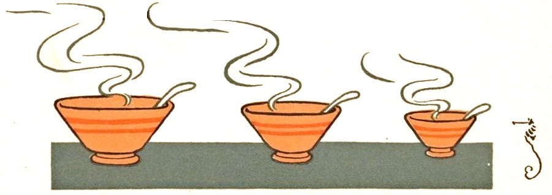
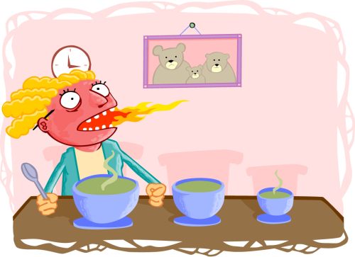
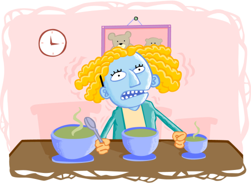
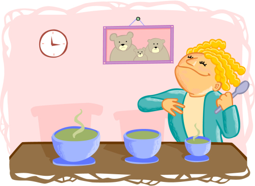
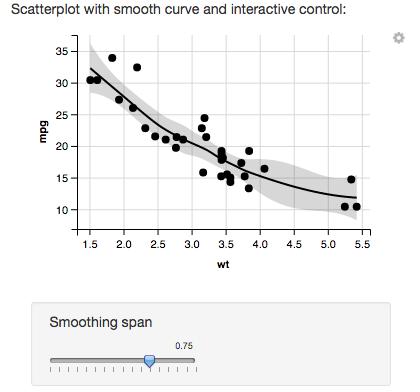
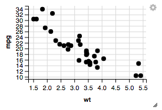

```{r setup, include=FALSE}
options(width = 60)
knitr::opts_chunk$set(echo = TRUE, cache = TRUE)
```

```{r, echo = F, message=F, cache = FALSE}
library("magrittr")
library("ggplot2")
```

### On the Agenda

1. Administrative Issues
    - HW4 & HW5 Assigned Tonight
    - Graded Exams available for pick up tomorrow during Office Hour
    - Group Project Proposal due date moved to **Friday July 21st, 2017**
2. Exploratory Data Analysis
    - Quantitative
    - Visual

### Group Project Update

- Help me, help you by letting me know about your group's project status
- Please answer:
    1. How is the project progressing?
    1. What has been accomplished thus far?
    1. What have you learned?
    1. What issues have arisen?
- *Avoid* showing me code in the report.
- Score for the progress report is based on how much work has been completed 
  since the project proposal was initially submitted.

# EDA 

## Background

### Starting an Analysis

> "When one begins an analysis, the facts of the analysis will *stick* to oneself."
>
> --- James Balamuta

What does it mean that the "facts" are **sticking** to them?

### Exploratory Data Analysis

**Exploratory Data Analysis (EDA)** is a philosophy for the beginning of an
analysis that describes a variety of techniques that are primarily visual
but sometimes quantitative in nature as pioneered by John Tukey in his 1977 book [Exploratory Data Analysis](https://www.amazon.com/Exploratory-Data-Analysis-John-Tukey/dp/0201076160)
$$ $$
The goals are to:

- understand the structure of the data;
- detect mistakes in importing data or within the dataset;
- find outliers and anomalies; and
- test underlying assumptions;

### Variable Types in Statistics

Unlike in *Base R*, Statistics views data stored in variables in two forms:

- Quantitative 
    - A *number* that describes an outcome
        - **Discrete**: Integers  e.g.  1 brother, 2 Starbucks Drinks
        - **Continuous**: Real number e.g. **86.25** on a test, $\pi = 3.141593\ldots$
- Categorical
    - A *character* that describes a trait
        - e.g. "Male" or "Female", "Student" or "Instructor", "Ninjas" or "Pirates"

### Types of EDA

There are two types of EDA:

- Quantitative
- Visual

Both with *ups* and *downs*.

## Verify Data

### Before tackling EDA...

Let's briefly review data ingestion. Verifying the correct data set is loaded
can save a lot of heartbreak at a later point. Especially if the naming
conventions between data sets differ greatly. 

### Sample data

To investigate this, we're going to simulate some data that might be
commonly associated with an experiment

```{r}
# Make some data
n = 20

# Set seed for reproducibility
set.seed(1133)
d = data.frame(id = paste0("s", sample(n, n)),
               sex = sample(c("male", "female"), 
                            n, replace = T),
               food = sample(c("cake", "pie"),
                             n, replace = T),
               trt_a = runif(n),
               trt_b = rnorm(n)
               )
```

### Verify the Data

The first step to this process is to verify the `data`. 

To do so, use:

- `head()` and `tail()` 
    - to make sure the data has been imported correctly.
- `nrow()` and `ncol()` OR `dim()`
    - to understand the amount of observations and variables.
- `class`
    - to verify import data type of each variable.
- `is.na`
    - to obtain whether missing values exist.

### Verify the Data - Head

```{r verify_head}
head(d)        # Defaults to showing the first 6 

head(d, n = 2) # Shows the first 2 
```

### Verify the Data - Tail

```{r verify_tail}
tail(d)        # Defaults to showing the last 6 

tail(d, n = 2) # Shows the last 2 
```

### Verify the Data - Observations and Variables

```{r verify_obs_and_vars}
nrow(d)  # Find the number of observations
ncol(d)  # Find the number of variables 
dim(d)   # Both observations and variables (n x p)
```

### Verify the Data - Check Data Types

```{r verify_data_types}
sapply(d, FUN = class)   # Obtain each columns data type
```

### Verify the Data - Missing Values

```{r verify_missing_sum_overview}
sapply(d, FUN = function(x) {
  sum(is.na(x))
})   # Missing values per column
```

# Quantitative 

## Types

### Univariate **Quantitative** Analysis

Depending on the *data type* there are different ways of obtaining
univariate **quantitative** information

- **numeric** 
    - 5 Summary
- **categorical**
    - frequency
    - contigency table

## Numeric

### Univariate **Quantitative** Analysis - Numeric

The 5 Summary Statistics are defined as follows:

- **Minimum**
    - `min()`
- **1st Quartile** or **25% Quantile**
    - `quantile(x, probs = 0.25)`
- **2nd Quartile** or **50% Quantile** 
    - `median()`
- **3rd Quartile** or **75% Quantile:** 
    - `quantile(x, probs = 0.75)`
- **Maximum:** 
    - `max()`
- **(*Optional*) Mean:** 
    - `mean()`

## 5 Summary Statistics 
 
### Univariate **Quantitative** Analysis - Numeric

```{r numeric_5}
stat5summary = function(x, na.rm = T){
  if(class(x) != "numeric") 
    stop("`x` must be numeric data")
  
  # Calculate quantiles
  q = quantile(x, probs = c(0.25, 0.5, 0.75),
               na.rm = na.rm)

  # Return
  c("min" = min(x, na.rm = na.rm),
    "q1" = q[[1]], "median" = q[[2]], "q3" = q[[3]], 
    "max" = max(x, na.rm = na.rm))
}
```

What might we want to add here? 

### Univariate **Quantitative** Analysis - Numeric

Let's try out our function!

```{r numeric_5_call}
sapply(d[, 4:5], FUN = stat5summary) 
```

### Univariate **Quantitative** Analysis - Numeric

Psst... the `summary()` function does this by default on `numeric` data!

```{r numeric_5_call_summary}
sapply(d[, 4:5], FUN = summary) 
```

### Regarding the `quantile` function

There are 9 different types of ways to compute quantiles. 
By default, we prefer to use the 7th type. See `?quantile` for more details.

## Median 

### Implementing a pure median

- Sort data.
- If the numbe of elements is odd then, the median is the center value.
- Else, take an average between the two center values.

```{r}
median_r = function(x) {
  n = length(x)
  half = (n + 1L) %/% 2L
  
  if (n%%2L == 1L) {
    sort(x)[half]
  } else { 
    mean(sort(x)[half + 0L:1L])
  }
}
```

## Categorical 

### Univariate **Quantitative** Analysis - Categorical

Categorical data normally is associated with:

- Frequency Counts
- Table Format $x$ vs. $y$
- Percentages

### Univariate **Quantitative** Analysis - Categorical

```{r category_count}
sapply(d[, 1:3], FUN = summary) 
```


### Univariate **Quantitative** Analysis - Categorical Tabulate

Overall counts between two variables

```{r category_table}
(o = table(d[, 2], d[, 3]))
```


### Univariate **Quantitative** Analysis - Categorical Proportions

Element / Total number of observations

```{r category_percentages}
prop.table(o)  # Requires table() object
```
    

### Univariate **Quantitative** Analysis - Categorical Headache

Make sure to avoid unique comparisons...

```{r category_table_error}
head(table(d[,1], d[,2]))
```

### Rules of Thumb

There are a couple *rules of thumb* that are slightly helpful with EDA and 
statistical modeling.

1. If the number of distinct numbers is less than 20, treat them as *categorical* 
variables.
2. Try to floor and cap *numerical* values to avoid large extrema. 
    - Floor and Cap means to set a boundary point for low and high values.
    - Never tell a robust statistician this...


### Exercises

1. Determine the summary information for the `PlantGrowth` dataset.
    - What variables exist, what kind of variables are there? 
2. Obtain the `msos` package from cran and look at the `spam` dataset.
    - How often was spam detected?
3. Download the `faraway` package from CRAN and explore the `pima` dataset.
    - Any pattern with missing values? 

# Visual

## A picture...

### Univariate **Visual** Analysis

> "The greatest value of a picture is when it forces us to notice what we never expected to see."
>
> --- John Tukey in Exploratory Data Analysis (1977)

### A sample data generation

```{r sample_data}
set.seed(2016) # Set Seed for reproducibility
n = 1e4        # Number of observations

(n*2) %>%      # Generate some data
  rnorm %>%
  matrix(ncol = 2) -> a

runif(n, 0, 2 * pi) %>%
  {0.5 * cbind(sin(.), cos(.))} -> b
  
o = rbind(a,b)   # Combine generate data

x = as.data.frame(o[sample(nrow(o)), ])

colnames(x) = c("x","y")
```

Do you know what is happening?

### Numerically we have...

```{r sample_data_summary}
summary(x)    # data.frame implements summary.
```

Insight: Data looks to be bounded between -4 and 4.

### Graphically we have ... 

```{r ggplot_exploratory, fig.height = 5}
ggplot(x) + geom_point(aes(x,y))
```

### Redux of Graphically we have ... 

```{r ggplot_exploratory_redux, fig.height = 5}
ggplot(x) + geom_point(aes(x,y), alpha = 0.05)
```

### A note...

- Notice in the previous slides, there was no call to `plot()`. 
- Instead, `ggplot()` was used to create the graphic through the use of layering via the `+` symbol.  
- To do the same with base *R*, we would of used:

```{r base_r_exploratory, fig.height = 5}
plot(x, col = rgb(0, 0, 0, 0.05)) # Transparent color
```

## Graph Systems

### Graphing in *R*

- Before now, we never really focused on plotting. 
- Instead, we aimed to understand the computing logic behind calculations in *R*. 
- Now, to support visual *EDA*, we really need to start focusing on such features. 

### *R* and the Three Graphing Systems

- Dilemma: There are ***3*** graphing systems to chose from in *R*.
- Similar to the **[Goldilocks and the Three Bears](https://en.wikipedia.org/wiki/Goldilocks_and_the_Three_Bears)** problem.



- Selecting the graphical system is important...

## Base R Plotting

### Different Plotting Systems in *R* - Overview

- R's `Base` plotting system.
    - `plot()`, `hist()`, `barplot()`
-  `lattice` formulaic graphing in *R*.
    -  `xyplot()`, `dotplot()`, `histogram()`, `*plot()` 
- `ggplot2` rapid layered graphing approach
    - graphs start with `ggplot()` and add layers via `+` typically denoted by `geom_point()` , `geom_*()`

### *R*'s Base Plotting System - Example

- View it as an artists blank canvas
```{r, fig.height=5}
plot(NULL, xlim=c(0,1), ylim=c(0,1), 
     ylab="Y Axis label", xlab="X Axis label")
```

### *R*'s Base Plotting System - Example

- Each subsequent function calls adds lines, points, axis, et cetera.

```{r echo = -c(1:3), fig.height=4}
plot(NULL, xlim=c(0,1), ylim=c(0,1), 
     ylab="Y Axis label", xlab="X Axis label")

set.seed(114)
x = runif(10); y = runif(10)
abline(h = .5)                # Horizontal Line
abline(v = .25, col="purple") # Vertical Line w/ color
points(x, y, pch = 1:10)      # Points w/ shapes
axis(1, .5, LETTERS[1], col.axis = "blue")
```

### *R*'s Base Plotting System - Verdict

- **Con:** No ability to change plot settings (e.g. `?par` settings) or draw content added once started.
- **Pros:** Easier custom graphs and higher quality graphs (e.g. [AVLR](http://smac-group.com/assets/pdfs/AVLR.pdf#page=4) using the
[`tikzDevice` package](https://cran.r-project.org/web/packages/tikzDevice/vignettes/tikzDevice.pdf) )

- **Verdict: Academics only**


```{r too_hot_goldilocks, out.width = "200px", fig.retina = NULL, fig.align='center', cache = TRUE, echo = FALSE}

```

[Credit: The Global Warmers](https://jility.wordpress.com/2013/06/04/and-the-three-bears/)

## lattice Plotting

### `lattice` - A formulaic approach to graphs.

- The [`lattice` package](https://cran.r-project.org/web/packages/lattice/index.html) written by [Deepayan Sarkar](http://www.isid.ac.in/~deepayan/) provides the ability to make graphs in *one* call vs. Base R's multiple
calls.  

- The call form is normally:

```{r eval = FALSE}
type_of_plot(formula, data=list())
```

- Uses the `formula` object associated with `lm` to specify: *response* (`y~`), *explanatory* (`~x`), *conditional relationships* (`y~x|A`).

- Great for viewing conditional relationships and multivariate data. 

### `lattice` - Example

```{r}
library("lattice")
xyplot(mpg ~ disp, data = mtcars)
```

### `lattice` - Example with Condition

```{r}
xyplot(mpg ~ disp | cyl, data = mtcars) # Note the |
```

### `lattice` - Verdict

- **Cons:** Everything in 1 function call is *messy* and awkward.
- **Pros:** Handle all margin settings of multiple graphs and conditioning.

- **Verdict: Casual *R* users.**


```{r too_cold_goldilocks, out.width = "200px", fig.retina = NULL, fig.align='center', cache = TRUE, echo = FALSE}

```

[Credit: The Global Warmers](https://jility.wordpress.com/2013/06/04/and-the-three-bears/)

## ggplot2 Plotting

### `ggplot2` - Grammar of Graphics 

- `ggplot2` is the implementation of the pivotal 1999 Book [Grammar of Graphics](http://www.springer.com/us/book/9780387245447) by [Leland Wilkinson](https://www.cs.uic.edu/~wilkinson/).
    - Each Graph shares a common structure.
    - The difference between graphs is different component layers and rules.

### `ggplot2` - Grammar of Graphics 
 
- Historical Information
    - [`ggplot1`](https://github.com/hadley/ggplot1) written by [Hadley Wickham](http://hadley.nz/) as part of [his PhD thesis](http://had.co.nz/thesis/).
    - [`ggplot2`](https://github.com/hadley/ggplot2) released for ease of use alongside [A Layered Grammar of Graphics](http://vita.had.co.nz/papers/layered-grammar.pdf)
    - [UseR 2016 Keynote: `ggplot1` is better than `ggplot2` API wise due to the piping operator](https://channel9.msdn.com/Events/useR-international-R-User-conference/useR2016/Towards-a-grammar-of-interactive-graphics)
         - Time: 36:38 to 38:32

### `ggplot2` - Scatterplot

```{r, fig.height = 5}
ggplot(mtcars) +               # Supply data.frame
  geom_point(aes(disp, mpg))   # Add points to plot
```

### `ggplot2` - Scatterplot Conditioned

```{r, fig.height = 5}
ggplot(mtcars) +               # Supply data.frame
  geom_point(aes(disp, mpg)) + # Add points to plot
  facet_wrap(~cyl)             # Write conditioning
```

### `ggplot2` vs. `Base R`

](img/gg-vs-base.png)


### `ggplot2` - Verdict

- **Cons:** Data must be in a `data.frame`, global scoping of variables, data copies, and simple things might be *complex*.
- **Pros:** Rapidly iterate visualizations,  grammatical structure, and extendable graphing system.

- **Verdict: Data Scientists, Researchers, and Causal *R* users.**


```{r just_right, out.width = "200px", fig.retina = NULL, fig.align='center', cache = TRUE, echo = FALSE}

```

[Credit: The Global Warmers](https://jility.wordpress.com/2013/06/04/and-the-three-bears/)

## ggvis

### I lied... 

- As is the case with technology, there always a new graphing system around the
corner. 
- Coming Soon a 4th Graphical System for *R* using the parts of `ggplot2`....


### `ggvis` - Coming Soon (TM)

- Introducing [`ggvis`](http://ggvis.rstudio.com/), the successor to `ggplot2`...




### `ggvis` - Coming Soon (TM)

- [`ggvis`](http://ggvis.rstudio.com/) will usher in a new way of interactive 
graphics (think `identify()`). Keep an eye on this project.
- Alas, as the API is currently in flux, we will not dedicate any time to
it. However, note that `ggvis` replaces `ggplot2`'s concatenation with the
`%>%` operator.

### `ggvis` - Example

```{r eval = F}
# install.packages("ggvis")
library("ggvis")
mtcars %>% ggvis(~wt, ~mpg) %>% layer_points()
```

```{r ggvis_scatter_plot, out.width = "175px", fig.retina = NULL, fig.align='center', cache = TRUE, echo = FALSE}

```

**Note:** This code can only be run in *HTML* rich environments. No LaTeX 
environments need apply.

## plotly

### plotly and ggplotly  

Bringing interactivity to present day _R_ graphs... Without needing `ggvis`!

For more details see: <https://plot.ly/r/>

# Exploring ggplot2

## Background

### Visual EDA

> "Use a picture. It's worth a thousand words"
>
> ---  Tess Flanders in *Speakers Give Sound Advice* 


### Data Wrangling `birth` from `msos` package.

For the next section, I'll aim to use the `birth` data from `msos`. Note,
the data is in **wide** form in a `matrix`. The below script sets up the 
data for graphing by converting it to **long** form and class `data.frame`.

```{r message = F, warning = F}
# Extract hospital birth dates
data(births, package="msos")

library("tidyr")
df_births = as.data.frame(births)
df_births$time = seq_len(nrow(df_births))
long_births = gather(df_births, hospital, value, -time)
```

### Looking into `long_births`

Let's peek at what the data in `long_births` looks like.

```{r}
head(long_births)
```

**Note:** `long_births` is of class `data.frame`!!

### Your first `ggplot`! 

```{r long_births, fig.height = 5}
ggplot(long_births) +       # Initialize ggplot w/ data
  geom_point(               # Add a point layer
    aes(x = time, y = value)# Add an aesthetic mapping
             )
```

### Your second `ggplot`! 

```{r long_births_color, fig.height = 5}
ggplot(long_births) +    # Initialize ggplot w/ data
  geom_point(            # Add a point layer
    aes(x = time,        # Add an aesthetic mapping
        y = value,       
        color = hospital)# Added color
             )
```

## Layering

### Key Terms and Ideas with `ggplot2`

- **ggplot**: Initialization function of the graph
- **geom_**: Geometric (shape) objects
- **aes**: Provides the aesthetic options the `geom` should take.
    - Examples: color, fill, transparency (alpha), linetype, and point shape.
- **scales**: Specifies the type of `axis` to use (very problematic)
    - Examples: Continuous, Discrete, $\log{}$, $\sqrt{}$, and so on.
- **facet**: Panel layout
    - Examples: Grid ($x \times y$) or Wrapped
- **stats**: statistical methods (e.g. regression, splines, binning)

### Reusing `ggplot2` base objects

Each `ggplot2` object can be saved individually and added to in the future

```{r fig.height=4}
g = ggplot(long_births) +   
  geom_point(aes(x = time, y = value))

g
```

### Adding Label Information to `ggplot2`

```{r fig.height=4}
(g = g + xlab("Time (hours)") + ylab("Births") + 
  ggtitle("Births vs. Time (hours)"))
```

### Changing `aes` for `geom_point`

```{r fig.height=4}
(g = g + geom_point(aes(x = time, y = value, color = hospital)))
```

### Adding a `facet_wrap` to distinguish variables

```{r fig.height=4}
(g = g + facet_wrap(~hospital))
```

### Graphing with `ggplot2`

- `ggplot2` makes available various geometric objects via `geom_`.
- These objects determine how the data is rendered on the plot.
- Some of the `geoms_*()` typically used:

| `geoms_*()`              |	Description
|--------------------------|---------------------------------------------|
| `geom_point()`	         | Adds data points to plot                    |
| `geom_line()`	           | Adds connected lines to the plot            |
| `geom_histogram()`	     | Makes a histogram                           |
| `geom_bar()`       	     | Creates a bar chart                         |
| `geom_text()`	           | Adds text annotations                       |
| `geom_violin()`	         | Makes a violin plot                         |

- Many more `geoms_*()` exists and can be found at [docs.ggplot2.org](http://docs.ggplot2.org/) 
with graphing examples!

## Histogram

### Making a histogram

Histograms typically provide count or frequency values on the `y`-axis

```{r fig.height=4}
ggplot(long_births) + 
  geom_histogram(aes(value), binwidth = 1)
```

### Making a histogram with a density plot

Density plots alongside a histogram require `density` (bounded between 0 and 1)
to be on the `y`-axis. If `count` is on the `y`-axis, then results are not valid.

```{r fig.height=4}
ggplot(long_births) + 
  geom_histogram(aes(x = value, y = ..density..),
                 binwidth = 1, color = "orange") + 
  geom_density(aes(value), color = "blue")
```

### Storing `aes` in construction

Specify `aes()` does not necessarily have to be done in the `geom_*()` call. 
Some users prefer to specify the relationship in the `ggplot()` creation.

```{r fig.height=4}
ggplot(long_births, aes(x = value)) +  
  geom_histogram(aes(y = ..density..), # Notice no `x=`
                 binwidth = 1, color = "orange") + 
  geom_density(color = "blue")         # Notice no `x=`
```

## Boxplot

### Boxplot

Boxplot are a helpful way to visualize Q1, Q2, Q3, and outlier information.
They are may be referred to as a *box and whiskers* plot. 

```{r fig.height = 4}
ggplot(long_births, aes(x = hospital, y = value)) + 
  geom_boxplot()
```

### Boxplot with Points

What is nice, is instead of only seeing outliers, you can also see where all the
points lie just by adding `geom_point()`

```{r fig.height = 4}
ggplot(long_births, aes(x = hospital, y = value)) + 
  geom_boxplot() + geom_point()
```

### Boxplot with Points Redux

However, adding points without *jittering* them will lead to non-informative
clumping. To avoid this, use a jitter: `geom_jitter()`

```{r fig.height = 4}
ggplot(long_births, aes(x = hospital, y = value)) + 
  geom_boxplot() + geom_jitter(height = 0, width = 0.4)
```

### Flipping My Box

**Note:** The jitter is applied at random (switch between slides)...

```{r fig.height = 4}
ggplot(long_births, aes(x = hospital, y = value)) + 
  geom_boxplot() + geom_jitter(height = 0, width = 0.4)
```

### Flipping My Box

The coordinate system can also change from being y-based to x-based via
`coord_flip()`.

```{r fig.height = 4}
ggplot(long_births, aes(x = hospital, y = value)) + 
  geom_boxplot() + geom_jitter(height = 0, width = 0.4) + 
  coord_flip()
```

## Themes

### Theming - Black & White

`ggplot2` can easily switch to different color themes.
By default, the `theme_gray()` is used. Some prefer
the `theme_bw()`.

```{r fig.height = 4}
ggplot(long_births, aes(x = hospital, y = value)) + 
  geom_boxplot()  + theme_bw()
```

### Theming - Original

```{r fig.height = 4}
ggplot(long_births, aes(x = hospital, y = value)) + 
  geom_boxplot()  
```

### The main question:

> Are you team `theme_gray()` or `theme_bw()`?

[Twitter Question](https://twitter.com/hadleywickham/status/676945091525742592)


### Exercises

1. Load `sportsranks` from `msos` and transform it to long form. Make sure to
add an indicator. Try to create boxplots of the different ratings. 
2. Open `states` in the `msos` data set. Explore the different levels of
school enrollment and crime. Try out other dimensions as well!
3. Last but not least, try to explore the `SAheart` data in `msos`.

## QQ Plot

### Practical Comparison

For the next example, we are going to craft a Q-Q Plot in `Base R` and `ggplot2`.
The Q-Q plot is normally used to check to see if the residuals of a model
follow a normal distribution.

```{r make_data}
# Set seed for reproducibility
set.seed(111)

# Generate data
x = runif(100,0,1)
```

### Traditional `q-q` plot in R

Included in *Base R*, without any modification is `qqnorm()`, which provides
the Q-Q Plot. Though, it is missing the traditional line connecting the first
and third quartiles. 

```{r fig.height=4}
qqnorm(x)                  # normal q-q plot
qqline(x,lty=2,col="blue") # line through the Q1 and Q3 quartiles
```

### Crafting the `q-q` plot

```{r q_qplot}
qqn = function(w) {
  n = length(w)
  nv = qnorm((1:n)/(n+1)) # Quantiles of Normal Dist.
  plot(nv, sort(w),       # X,Y
       xlab = "Theoretical Quantiles",
       ylab = "Sample Quantiles")
  title("Normal Q-Q Plot")
  m = (quantile(w,0.75)-quantile(w,0.25))/
      (qnorm(0.75)-qnorm(0.25))
  b = quantile(w,0.25) - m*qnorm(0.25)
  abline(b, m, lty=2, col="red") # Line through Q1 & Q3
}
```

### Comparing Base implementations

```{r, fig.height=4}
par(mfrow = c(1, 2), pty= "s") #  Two plots, square pts
qqnorm(x)                      # Base R first
qqline(x,lty=2,col="blue")
qqn(x)                # Our Plot
```

### `ggplot2` implementation

```{r, fig.height = 4}
df_x = as.data.frame(x)
n = nrow(df_x)
m = (quantile(x,0.75)-quantile(x,0.25))/
      (qnorm(0.75)-qnorm(0.25))
b = quantile(x,0.25) - m*qnorm(0.25)
g = ggplot(df_x, aes(sample=x)) + 
      stat_qq() +
      geom_abline(intercept = b,
                  slope = m,
                  color = "purple") +
      xlab("Theoretical Quantiles") +
      ylab("Sample Quantiles") +
      ggtitle("Normal Q-Q Plot")
```


### `ggplot2` implementation

```{r, echo = F}
g
```


### `ggplot2` implementation

```{r}
g + theme_dark() # Welcome to the dark side!
```
