```{r setup, include=FALSE}
options(width = 60)
knitr::opts_chunk$set(echo = TRUE, cache = TRUE)
```

```{r, echo = F, message=F, cache = FALSE}
library("shiny")
```

### On the Agenda

- Shiny
    - Background information
    - Making an App
         - Frontend vs. Backend

# Shiny

## Motivation

### What is Shiny?

> [Shiny](http://shiny.rstudio.com/) is an R package that makes it easy to build interactive web applications (apps) straight from R.

```{r movie_explorer, out.width = "225px", fig.retina = NULL, fig.align='center', cache = TRUE, echo = FALSE}
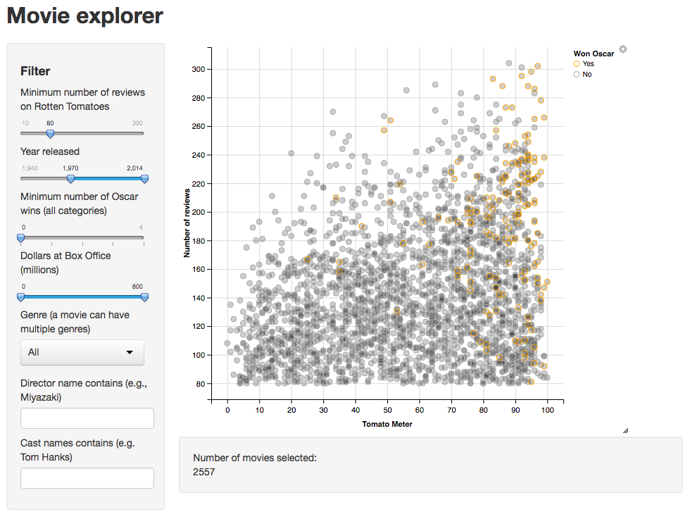
```

### Why Shiny?

- Access features in the *R* ecosystem without knowing *R*!
- Standardized interactive explorations of data
- Easy deployments via:
    - **Local:** [shiny::runApp()](https://cran.r-project.org/web/packages/shiny/)
        - development and package inclusion
    - **Server:** [shiny-server](https://www.rstudio.com/products/shiny/shiny-server/) 
        - On premise use for companies
        - [STATS@UIUC](http://www.stat.illinois.edu) runs this on: [rstudio.stat.illinois.edu/shiny](https://rstudio.stat.illinois.edu/shiny)
    - **Cloud:** [shinyapps.io](http://www.shinyapps.io/) 
        - Avoids management headaches and have easy access to scaling computational resources.

### Hello Shiny World!

```{r hello_shiny, out.width = "250px", fig.retina = NULL, fig.align='center', cache = TRUE, echo = FALSE}
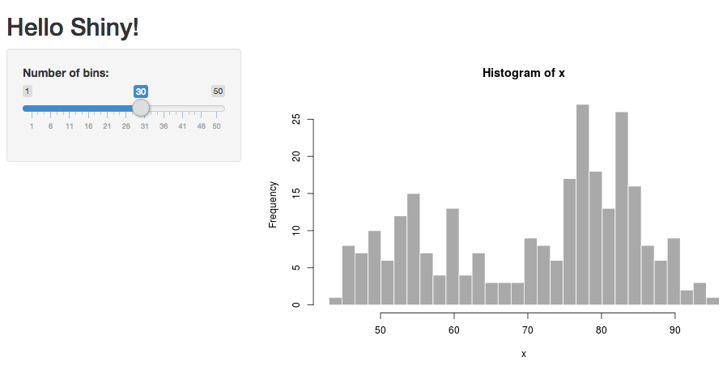
```


```{r eval = F}
# install.packages("shiny") # Install if on local 
library(shiny)              # Load Shiny
runExample("01_hello")      # Run above example
```

# Shiny Projects

## Creation

### Setting up a Shiny Project - Dropdown Menu

- Select the project dropdown menu and press **New Project**

```{r new_project, out.width = "150px", fig.retina = NULL, fig.align='center', cache = TRUE, echo = FALSE}
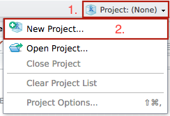
```

### Setting up a Shiny Project - New Directory

- Select **New Directory**

```{r new_directory, out.width = "225px", fig.retina = NULL, fig.align='center', cache = TRUE, echo = FALSE}
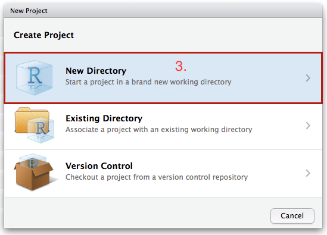
```

### Setting up a Shiny Project - Project Type

- Select **Shiny Web Application**

```{r shiny_project, out.width = "225px", fig.retina = NULL, fig.align='center', cache = TRUE, echo = FALSE}
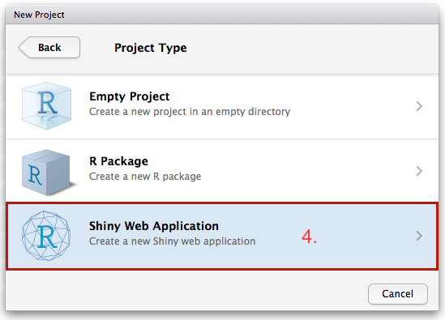
```

### Setting up a Shiny Project - Initialization Values

- Enter a project name (directory) for your shiny app.
- Check the **Create a git repository**
- Press **Create Project**

```{r name_shiny, out.width = "225px", fig.retina = NULL, fig.align='center', cache = TRUE, echo = FALSE}
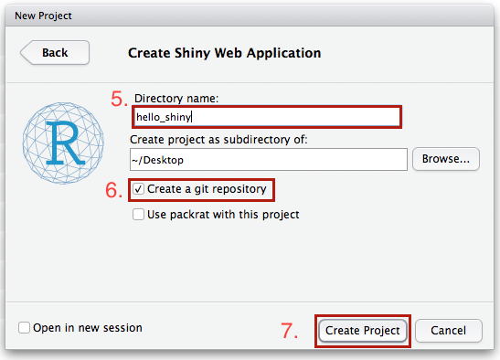
```

### Exploring the Default Shiny App - Structure

- Once the project is created, an example shiny app is centerfold:

```{r shiny_app_load, out.width = "225px", fig.retina = NULL, fig.align='center', cache = TRUE, echo = FALSE}
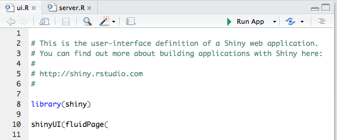
```

**Note:** The presence of two files *ui.R* and *server.R*

## Launching

### Exploring the Default Shiny App - Running

To run a shiny within a project there are three options:

1. Type `runApp()` in **Console**
2. Use a keyboard shortcut
    - macOS: `Command` + `Shift` + `Enter`
    - Windows: `Control` + `Shift` + `Enter`
3. Press the `Run App` button at the upper right of the script editor.

```{r run_app, out.width = "150px", fig.retina = NULL, fig.align='center', cache = TRUE, echo = FALSE}
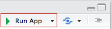
```


### Exploring the Default Shiny App - Live App

A secondary window will open and the Shiny app will be displayed.

- **Note:** Using RStudio on the analytical environment may require you to allow pop-ups!

```{r running_example, out.width = "250px", fig.retina = NULL, fig.align='center', cache = TRUE, echo = FALSE}
knitr::include_graphics("img/project/running_example.png")
```

Try moving the slider and comment to your group mates what happens to the 
histogram.


### Lions, Tigers, and Bears... Oh my!

```{r r_talks_to_web_browser, out.width = "250px", fig.retina = NULL, fig.align='center', cache = TRUE, echo = FALSE}
knitr::include_graphics("img/r_talks_to_web_browser.png")
```

# In-depth Shiny

## server.R and ui.R

### Behind the Scenes a Shiny App

As hinted to earlier, there are two files responsible for the creation of the 
shiny App: **ui.R** and **server.R**.

- **ui.R:** is responsible for providing the
 user interface (ui) or _frontend_ for the shiny application.
- **server.R:** is responsible for providing the _backend_ logic behind each 
 change that occurs due to a button click, slider drag, et cetera on the frontend.

```{r backend_v_frontend, out.width = "175px", fig.retina = NULL, fig.align='center', cache = TRUE, echo = FALSE}
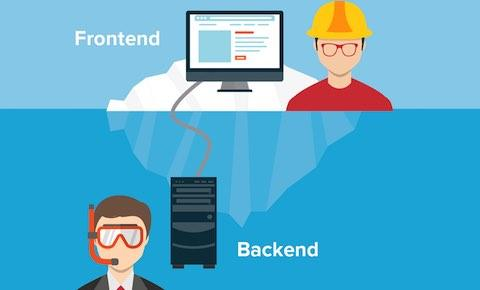
```

### Behind the Scenes a Shiny App

The following is the bare minimum for a Shiny App to function.

**ui.R**

```{r basic_ui, eval = F}
shinyUI(      # Initialize a UI container in Shiny
  fluidPage() # Make a page layout
)
```

**server.R**
```{r basic_server, eval = F}
shinyServer(                # Initialize Server
  function(input, output) { # Input and output
  }
)
```

### Blank Shiny

**Note:** Running the previous code will yield an empty app with a blank user-interface.

```{r blank_shiny, out.width = "250px", fig.retina = NULL, fig.align='center', cache = TRUE, echo = FALSE}
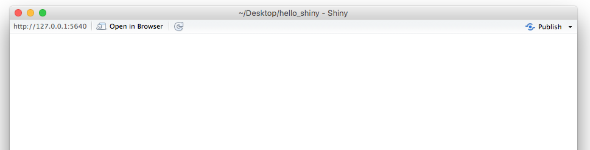
```

## Building a Shiny App

### Beginning a Shiny App

- To motivatie our exploration of Shiny, we will create a shiny app that is able 
to *switch* between different datasets.
- We will begin by first constructing the User Interface (**ui.R**)
- Then we will write the backend logic (**server.R**)

## Layouts

### Making Content

We can add content to the UI by using:

| Function         | Description                                                |
|------------------|------------------------------------------------------------|
| `titlePanel()`   | Naming the application (e.g. Hello Shiny!)                 |
| `sidebarLayout()`| Creates a sidebar layout for the `fluidPage()`.            |
| `sidebarPanel()` | Makes a side bar **menu** for UI Controls and Instructions |
| `mainPanel()`    | Main content area to house graphs, tables, text output     |

### Making Content for the Interface

**ui.R**

\scriptsize

```{r ui_content, eval = F}
shinyUI(
  fluidPage(
    titlePanel("My Shiny App Title"), # Title

    sidebarLayout(
      
      sidebarPanel(
        h1("SideBar Title")           # Sidebar Text
        ),                            # Note HTML
      
      mainPanel("Main Content")       # Content Text
    )
  )
)
```

Note: You can use attributes such as `align = "center"` by
`h1("SideBar Title", align = "Center")`

### Making Content for the Interface - Preview

If we run our app, we will get:

```{r content_interface, out.width = "300px", fig.retina = NULL, fig.align='center', cache = TRUE, echo = FALSE}
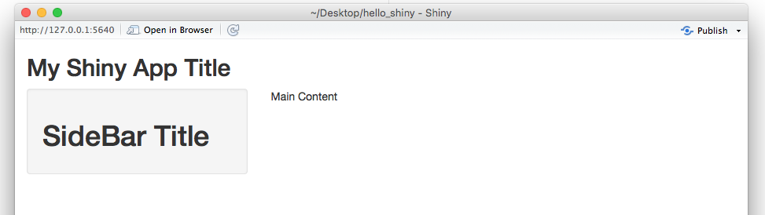
```


### HTML in Shiny

| Function   | HTML                  |	Description            |
|------------|-----------------------|-------------------------|
| `strong()` | `<strong></strong>`   |	Bold Text              |
| `em()`	   | `<em></em>`           |	Italicize Text         |
| `a()`	     | `<a></a>`             |	Makes a hyperlink      |
| `p()`	     | `<p></p>`             |	Text Paragraph         |
| `h1()`	   | `<h1></h1>`           |	Header (replace 1 )    |
| `br()`	   | `<br />`              |	Creates a page break   |
| `div()`	   | `<div></div>`         |	Division of text       |
| `code()`   | `<code></code>`       |	Code formated block    |
| `HTML()`	 | -                     |	Embed own HTML Code    |

**Note:** `h2()` up to `h6()` provides different heading styles.

- **[More Shiny HTML Tags...](http://shiny.rstudio.com/articles/tag-glossary.html)** (About 110 of them!)
- **[UI Customization with HTML](http://shiny.rstudio.com/articles/html-tags.html)**

## Input Values

### Making Inputs

- Create HTML from within R is nice, but we want to be able to talk to R. 
- To do that, we must make some sort of input control.
- In Shiny, the input control comes from *widgets*

### Making Widgets for Input

To construct a **widget**, we must:

- Provide a `name=""`
    - We will use this to get the active value.
    - Users will not be able to see the name.
- Provide a `label=""`
    - This describes the widget to the user.
    
### Making Widgets for Input - Example

**ui.R**

\scriptsize
```{r ui_widgets, eval = F}
sidebarLayout(
  sidebarPanel(
    h3("Data Selection"),             # Note the , 
    
    # Dropdown
    selectInput("ds",                 # Name
                "Choose a dataset:",  # Label
                choices = c("iris", "Spam", "mtcars")),
     
    numericInput("obs",               # Name
                 "Number of Obs:",    # Label
                 10),                 # Default Value
    
    submitButton("Load Preview Data") # Update data
  ),
  mainPanel())# Not Displayed         # Content
```


### Making Widgets for Input - Preview

```{r load_preview, out.width = "250px", fig.retina = NULL, fig.align='center', cache = TRUE, echo = FALSE}
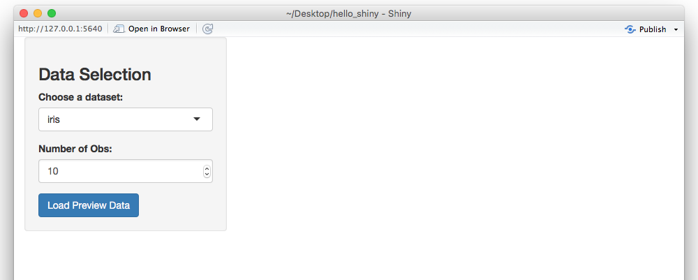
```

    
### UI Input Controls

Shiny features a lot of different ways to accept user input

| Function                 |	Description                              |
|--------------------------|-------------------------------------------|
| `numericInput()`	       | Number entry input                        |
| `radioButtons()`	       | Radio button selection                    |
| `selectInput()`	         | Dropdown menu                             |
| `sliderInput()`	         | Range slider (1/2 values)                 |
| `submitButton()`	       | Submission button                         |
| `textInput()`	           | Text input box                            |
| `checkboxInput()`	       | Single checkbox input                     |
| `dateInput()`	           | Date Selection input                      |
| `fileInput()`	           | Upload a file to Shiny                    |
| `helpText()`	           | Describe input field                      |

See **[Shiny Widgets Gallery](http://shiny.rstudio.com/gallery/widget-gallery.html)** for examples.

## Render UI Areas

### Making Render UI Areas

- So far, we have managed to make stylistic features and input controls.
- However, in order for the *Shiny* app to be dynamic and display data, we must have
output control or render areas. 
- To do so:
    1. We add an output control to **ui.R**.
    2. Make some logic in **server.R** to talk with it! (Yes, we're almost there.)

### Making Render UI Areas - Example

```{r eval = F}
sidebarLayout(
  sidebarPanel(), # Given previously
  mainPanel(
    h3("Head of the Dataset"),    # HTML
    tableOutput("view"),          # Table View
    
    h3("Dataset Summary"),        # HTML
    verbatimTextOutput("summary") # Output Asis
  )
)
```

**Note:** Like the input control, we do *name* the output values.

### UI Output Controls

There are many ways to render the results 

| Function	                 | Description             |
|----------------------------|-------------------------|
| `plotOutput()`	           | Display a rendered plot |
| `tableOutput()`	           | Display in Table        |
| `textOutput()`	           | Formatted Text Output   |
| `uiOutput()`	             | Dynamic UI Elements     |
| `verbatimTextOutput()`     | "as is" Text Output     |
| `imageOutput()`	           | Render an Image         |
| `htmlOutput()`	           | Render Pure HTML        |

Also see:

- **[Dyanmically Generated User Interface Components](http://shiny.rstudio.com/gallery/dynamic-ui.html)**
- **[Changing the Values of Inputs from the Server](http://shiny.rstudio.com/gallery/update-input-demo.html)**

### Moving over to **server.R**

- We've finished what we needed to accomplish in the **ui.R** file. 
- Now, we must write the backend logic in **server.R**.

## Reactivity

### What is Reactivity?

> "For every action, there is an equal and opposite reaction."
> 
> -- Issac Newton


### What is Reactivity?

- **Reactive Sources (Reactive Values)** 
    - UI element inputs
- **Reactive Conductors (Reactive Expressions)** 
    - Server Catches for UI elements `reactive({})`
- **Reactive Endpoints (Observers)**
    - Render functions in the UI and `observer({})` in Server
    
```{r roles_implement, out.width = "250px", fig.retina = NULL, fig.align='center', cache = TRUE, echo = FALSE}
knitr::include_graphics("img/roles_implement.png")
```    

View **[Reactivity Explanation](https://vimeo.com/rstudioinc/review/131218530/212d8a5a7a#t=47m25s)**

**Note:**  Reactive expressions return values, but observers don’t.

### Accessing a Reactive Element

Reactive elements can be found living in either the `input`, `output`, or `session` variables.
The later of which is only found in Shiny Server Pro applications.

To access a reactive source from the UI use name you gave to the component:

```r
input$name
```

So, to access to the data set choice, we would use: 

```r
input$ds
```

### Creating a Reactive Catch

**server.R**

```{r eval = F}
library("msos"); library("dataset")
data("Spam")
shinyServer(function(input, output) {
  
  dsInput = reactive({   # Reactive
    switch(input$ds,     # Load dataset
           "iris" = iris,
           "Spam" = Spam,
           "mtcars" = mtcars)
  })

})
```

## Observers

### Observers In-depth

Observers perform _actions_ and do _not_ return values when either
reactive values or expressions change.

There are two forms of observers:

- **Implicit**: Triggered whenever _any_ reactive values or expressions changed
  within the scope: 

```r
observe({...})
```

- **Explicit**: Code is triggered only when a specific reactive value or expression changes. 
  Any other reactive values outside of the **observed reactive event** are ignored. 

```r
observeEvent(observed_reactive_event, {...})
```

### Observers example

```r
shinyServer(function(input, output) {

  # Whenever either input$x or input$y change, execute
  observe({
    cat("input$x has", input$x, 
        "and input$y has", input$y ,"\n")
  })
  
  # Execute only when form submission occurs
  observeEvent(input$form_submission, {
    cat("On form submit, we have: input$x with", input$x, 
        "and input$y with", input$y ,"\n")
  })
}
```

## Output Hooks


### Creating Output Hooks

Output hooks defined as: 

```r
output$view = renderTable({...})
```

serves as a recipe for what should be used when updating `view`. 

Avoid making the mistake of interpreting the code as triggering the update to
`view` with the results.


### Creating Output Hooks

**server.R**

```{r eval = F}
shinyServer(function(input, output) {
  
  ## Hiding data set reactive
  
  output$summary = renderPrint({   # Summary Render
    summary(dsInput())
  })
  
  output$view = renderTable({      # Table Render
    head(dsInput(), n = input$obs)
  })
})
```

### Creating Observer Hooks - Preview

```{r full_app, out.width = "250px", fig.retina = NULL, fig.align='center', cache = TRUE, echo = FALSE}
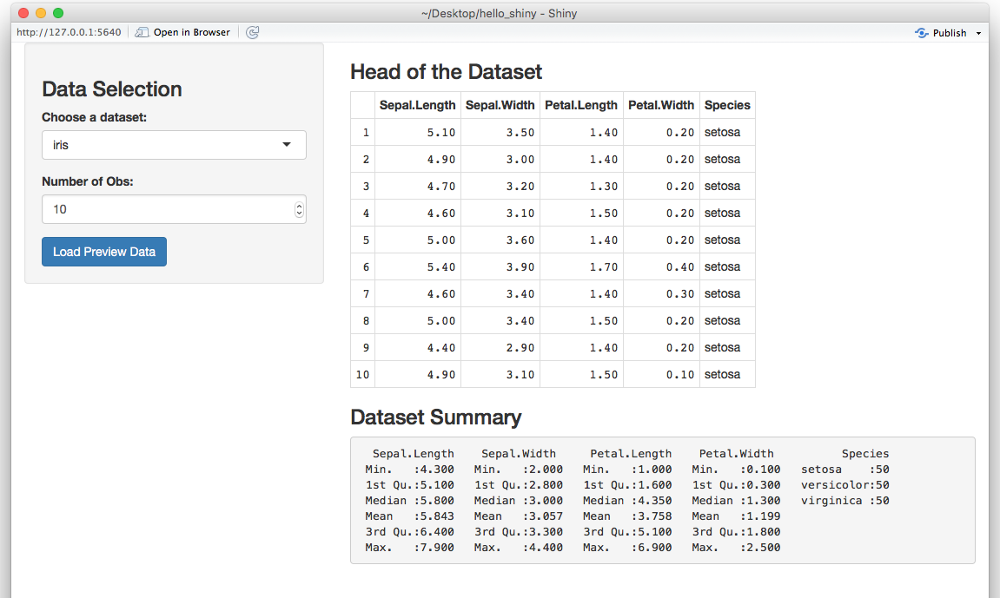
```

### Displaying Reactivity

The functions below are meant to interface with the `*Output()` UI functions.

| Function            | Description                             |
|---------------------|-----------------------------------------|
| `renderPlot()`	    | Display Plots                           |
| `renderPrint()`	    | Output Print (Verbatim)                 |
| `renderTable()`	    | Tables for 2D Data Structures           |
| `renderText()`	    | Display Character Strings               |
| `renderUI()`	      | Dynamic UI render                       |
| `renderImage()`	    | Saved Images on Disk                    |

## Shiny Environment

### Understanding Shiny Runtime Components

Shiny runtime components is slightly different than normal. Certain areas
of the **server.R** are either run:

- Once on startup
    - Initializing the application on server
- Once per user visit    
    - Loading user info
- Many times per session 
    - Reactive control

### Understanding Shiny Runtime Components - Startup

**server.R**

```{r, eval = F}
load("data.rda")            # Once during startup

shinyServer(                # Once during startup
  
  function(input, output) { 
    toad = "Hello"

    output$test = renderUI({
      
    })
  }
)
```

### Understanding Shiny Runtime Components - User Session

**server.R**

```{r, eval = F}

load("data.rda")            

shinyServer(                
  
  function(input, output) {  # Once per user
    toad = "Hello"
    
    output$test = renderUI({
      
    })
  }
)
```

### Understanding Shiny Runtime Components - Actions

**server.R**

```{r, eval = F}

load("data.rda")            

shinyServer(                
  
  function(input, output) { 
    toad = "Hello"
    
    output$test = renderUI({ 
                             # Many Times
    })
  }
)
```

## Resources

### Resources for Shiny

```{r shiny_web_head, out.width = "250px", fig.retina = NULL, fig.align='center', cache = TRUE, echo = FALSE}
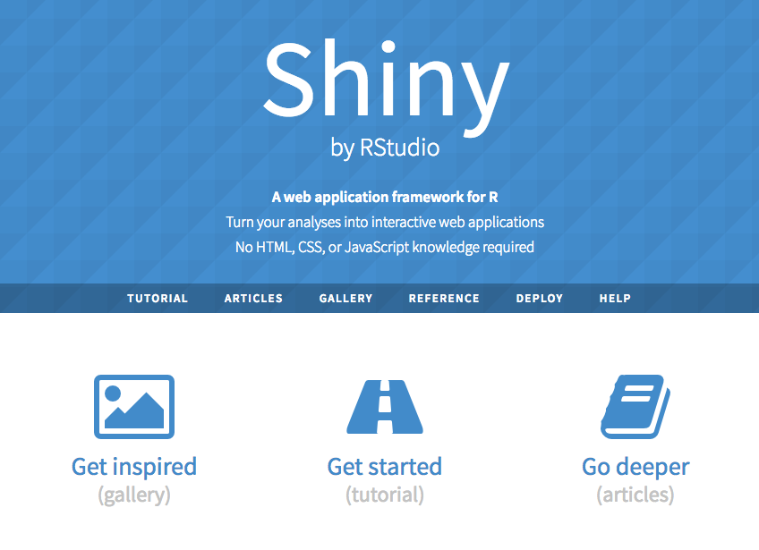
```

**[Shiny Page](http://shiny.rstudio.com/)** - **[Real Live Apps](http://shiny.rstudio.com/gallery/)** - **[Video](http://shiny.rstudio.com/tutorial/)** and **[Written Tutorials](http://shiny.rstudio.com/tutorial/lesson1/)** 

### More Resources for Shiny

- [Shiny on Github](https://github.com/rstudio/shiny)
- [Shiny Development Mailing List](https://groups.google.com/forum/#!forum/shiny-discuss)
- [Shiny Function Reference](http://shiny.rstudio.com/reference/shiny/latest/)
- [Shiny Debugging Tips and Tricks](https://shiny.rstudio.com/articles/debugging.html)

### Acknowledgement

This lecture goes into depth about the [Shiny More Widgets Example](http://shiny.rstudio.com/gallery/widgets.html)
on [Shiny Gallery](http://shiny.rstudio.com/gallery/) and discusses reactivity
based on [Joe Cheng's "Ladder of Enlightenment" for Shiny](https://github.com/rstudio/ShinyDeveloperConference/tree/master/Reactivity).