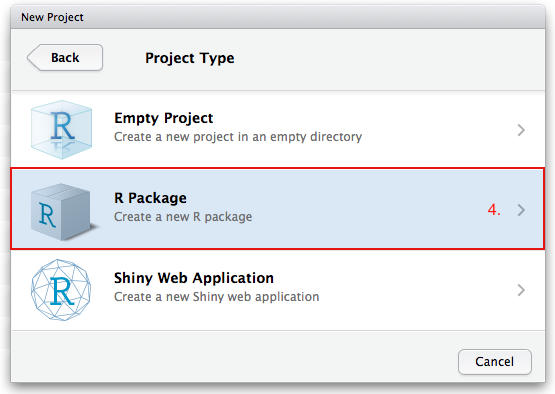
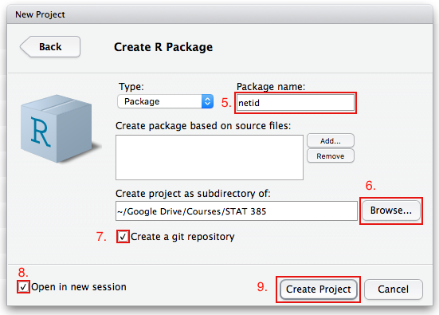
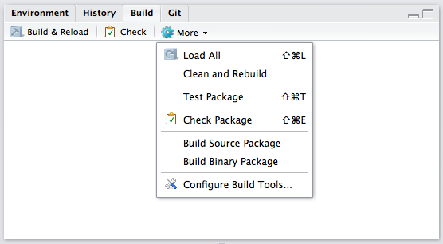
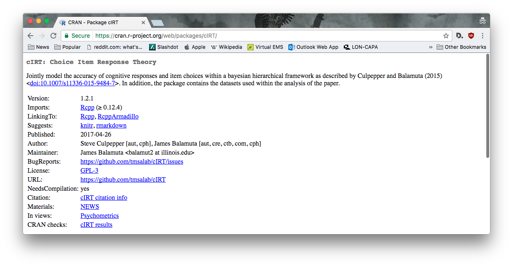
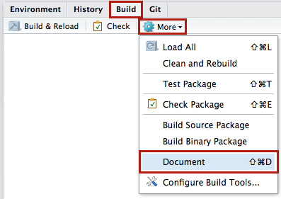

```{r setup, include=FALSE}
options(width = 60)
knitr::opts_chunk$set(echo = TRUE, cache = TRUE)
```

```{r, echo = F, message=F, cache = FALSE}
library("devtools")
```

### On the Agenda

- R Packages
    - Motivation
    - Package Structure
    - Documentation
    - Testing
    - Data

# R Packages

## Background

### What is an R package?

> Packages are the fundamental units of reproducible R code. They include reusable R functions, the documentation that describes how to use them, and sample data. 
>
> -- Hadley Wickham in [R packages](http://r-pkgs.had.co.nz/)

### How many R packages are out there?


```{r echo = F}
a = nrow(available.packages(repos="http://cran.r-project.org/"))
```

- At the time of this writing, there are **`r a`** packages on CRAN! 
- This does **not** include packages on GitHub, RForge, or in an additional repository.

```{r eval = F}
# See all R packages on CRAN
available.packages()  
```

### Why an R Package?

Why not? 

- Code is already organized via functions. 
- Nothing already exists (hence why you wrote it!)
- Give back to the community, *pay it forward*
    - Example: All class material is made *freely* available for non-commerical use.
- Portfolio of your coding and development skills.
    - Examples: 
    [sitmo](https://github.com/coatless/sitmo),
    [cIRT](https://github.com/tmsalab/cIRT), [balamuta](https://github.com/coatless/balamuta), ...
- If you track the package via VCS, you can see how much you've grown as a 
  developer and statistician.

# R Package Projects

## Creation

### Setting up an R Package Project - Dropdown Menu

- Select the project dropdown menu and press **New Project**

```{r new_project, out.width = "150px", fig.retina = NULL, fig.align='center', cache = TRUE, echo = FALSE}
knitr::include_graphics("img/package_build/new_project.png")
```

### Setting up an R Package Project - New Directory

- Select **New Directory**

```{r new_directory, out.width = "225px", fig.retina = NULL, fig.align='center', cache = TRUE, echo = FALSE}
knitr::include_graphics("img/package_build/new_directory.png")
```

### Setting up an R Package Project - Project Type

- Select **R Package**

```{r rpackage_project, out.width = "225px", fig.retina = NULL, fig.align='center', cache = TRUE, echo = FALSE}

```

### Naming an *R* Package

- Three requirements to a package name. It must: 
    1. Only contain letters, numbers and periods (`.`)
    2. Start with a letter
    3. Not end with a period  (`.`)
- Examples:
    - Good: stat385, UIUCstats, AutoGrader, vis.ualize
    - Bad: data-pkg, funny_r, orgk!J@*%, -bootstrappeR, 2r, Rman., 90120r
- **Note:** Avoid using a `.` in package name due to S3 methods.

### Setting up an R Package Project - Initialization Values

- Enter a name for your package (per rules on last slide)
- Check the **Create a git repository** and **Open in a new session**
- Press **Create Project**

```{r name_rpackage, out.width = "225px", fig.retina = NULL, fig.align='center', cache = TRUE, echo = FALSE}

```

### View of an R Package in RStudio

```{r rstudio_package_view, out.width = "350px", fig.retina = NULL, fig.align='center', cache = TRUE, echo = FALSE}
knitr::include_graphics("img/package_build/rstudio_package.png")
```

### RStudio Build Tab

- Notice the new "`Build`" Tab added in the upper right corner
- This handles: 
    - Building your package
    - Creating documentation
    - Checking your package
    - Making package bundles

```{r rstudio_build_tab, out.width = "250px", fig.retina = NULL, fig.align='center', cache = TRUE, echo = FALSE}

```

# Behind the Scenes

## Package Structure

### Basic Structure of an R Package

The bare minimum for an R package to exist is the following directory structure:

```{r eval = F, engine='bash'}
netid
|- DESCRIPTION        # Package meta
|- NAMESPACE          # Register functions
|- R/                 # All R Code
   |- hello.R
|-  man               # Documentation
   |- hello_me.Rd     # Example Documentation
```

### Crafting a `DESCRIPTION` file

- The `DESCRIPTION` file specifies the meta data to be associated with your package. 
- Meta data covers the: 
     - Title
     - Description
     - Authors
     - Version
     - Dependencies
     - and more!
     
### Crafting a `DESCRIPTION` file - Use on CRAN

```{r cran_description, out.width = "300px", fig.retina = NULL, fig.align='center', cache = TRUE, echo = FALSE}

```

**[`cIRT` CRAN page](https://cran.r-project.org/web/packages/cIRT/)** | 
**[`DESCRIPTION` file source on GitHub](https://github.com/tmsalab/cIRT/blob/b87eb6c2c3ac815ef8ab1f56d973e22e107833b9/DESCRIPTION)**

### Crafting a `DESCRIPTION` file - Example

```{r eval = F, engine='bash'}
Package: netid
Title: What The Package Does (Title Case)
Version: 0.1.0
Authors@R: c(person("First", "Last", 
                    email = "first.last@somewhere.net",
                    role = c("aut", "cre")),
             person("J", "B", 
                    email = "J.B@somewhere.net",
                    role = c("aut","ctb"))
Description: More about what it does 
    (maybe more than one line)
    with the following line four indented inwards
Depends: R (>= 3.4.1)
License: What license is it under?
LazyData: true
```

### Crafting a `DESCRIPTION` file - Example Extended

- To add package dependencies, use the `Imports:` field. 
     - Package will be automatically downloaded when `install.packages()` is run.
- To suggest, but **not require**, the use of another package use `Suggests:`
     - Packages must *previously* be installed by user.
     
```{r eval = F, engine='bash'}
Imports: rvest
Suggests: testthat,
    knitr,
    rmarkdown
VignetteBuilder: knitr
```

In the case presented above, `rvest` must be present. However, users do not
necessarily need `knitr` or `rmarkdown` unless they want to be able to generate 
the extended documentation via our vignettes.

### Crafting a `DESCRIPTION` file - Specific Versions

We can also specify a specific package version by adding:

- `pkgname (>= 0.2.1)`
- `pkgname (== 0.2.1)`
- `pkgname (<= 0.2.1)`

Note, we did this to force users to have *R* greater than or equal to 3.4.1 via

```{r eval = F, engine='bash'}
Depends: R (>= 3.4.1)
```

### Protect against `Suggests:` packages

If you do use a feature of a `Suggests:` package, make sure to protect against
the call via:

```{r, eval = F}
if (!requireNamespace("suggestpkg", quietly = TRUE)) {
  stop("`suggestpkg` is required to use this function.",
       " It must be installed.")
}
```

or

```{r, eval = F}
if (requireNamespace("suggestpkg", quietly = TRUE)) {
  # Call function in suggestpkg via namespace
  suggestpkg::function_name()
} else {
  # Custom code 
}
```

## Licensing

### Crash into Licensing

- Before you begin uploading code, make sure to choose an open source license that
is compatible with *R*. 
- The rationale behind licensing code is to relieve you
of any liabities that may arise should someone use your code. 
- Furthermore, it
enables you to retain rights to the work that you have done. 

### Licensing within R

See **[Licensing](https://cran.r-project.org/doc/manuals/R-exts.html#Licensing)**
within **[Writing R Extensions](https://cran.r-project.org/doc/manuals/R-exts.html)**

View differences between licenses at:

- **[choosealicense.com](http://choosealicense.com/licenses/)**
- **[tldrlegal.com](https://tldrlegal.com/)**

If you want to make money or do commercial endavors, make sure to **contact a lawyer**
before choosing a license!

### General License

The MIT license should be sufficient for your present needs as it enables the
code to be embedded in multiple projects without the worry of needing to be 
developed in the open. The downside is the loss of commerical ability and 
changes are not propogated back to the initial source. If this doesn't appeal
to you consider looking at the GPL 3 license.

To use this in *R* add the `DESCRIPTION` file:

```{r eval = F, engine='bash'}
License: MIT + file LICENSE
```

Now, create a new file called `LICENSE` and add:

```{r eval = F, engine='bash'}
YEAR: <Current Year>
COPYRIGHT HOLDER: <Name of Copyright Holder>
```

## R Code

### Writing R Code

To use code within an R package, the code must be in function-facing form.

```{r}
multiply =  function(x, y) {
  x * y
}
```

**Not**

```{r eval = F}
x*y
```

### Writing R Code - `/R/`

All *R* code in function form must be placed into the `/R/` directory. 

- `/R/binary-ops.R`

```{r}
multiply =  function(x, y) {
  x * y
}
divide =  function(x, y) {
  x / y
}
```

- Try to group functions of families *together* to avoid hunting in codefiles

## Documentation

### Adding documentation - Stone Age

- Previously, one had to manually make documentation to use within *R*'s help system.
    - e.g. `?func` or `help(func)`
- To do so, one would write `funcName.Rd` or `dataset.Rd` per function/dataset
  and place it in the `/man/` directory.
- Documentation was completely detached from source.
- Worse yet, the documentation had a LaTeX structure to it that was not 
  necessarily kind.

### Adding documentation - Stone Age Example

\scriptsize
```{r eval = F, engine='bash'}
\name{multiply}
\alias{multiply}
\title{Multiple Two Numbers}
\usage{ multiply(x, y) }
\arguments{
\item{x}{A \code{numeric}.}
\item{y}{A \code{numeric}.}
}
\value{ Product of \code{x} and \code{y}.}
\description{ 
  Takes two numbers and returns their product
}
\examples{
multiply(1, 1)
multiply(4, 6)
}
```

### Adding Documentation - Modern Age

- Now, a much better way to accomplish this is via: [`roxygen2`](https://cran.r-project.org/web/packages/roxygen2/).
- [`roxygen2`](https://cran.r-project.org/web/packages/roxygen2/) is *R*'s take
on [`doxygen`](http://www.stack.nl/~dimitri/doxygen/) and 
[`javadoc`](http://www.oracle.com/technetwork/articles/java/index-137868.html)
inline documentation.
- Uses `@keyword value` structure to write documentation
- Templating options and inherit options are available as well! 
- Leads to more cohesive documentation as the worry about **Don't Repeat Yourself**
decreases.


### Example `roxygen2`

```{r, eval = FALSE}
#' Multiple Two Numbers
#' 
#' Takes two numbers and returns their product
#' @param x A \code{numeric}.
#' @param y A \code{numeric}.
#' @return Product of \code{x} and \code{y}.
#' @examples
#' multiply(1, 1)
#' multiply(4, 6)
#' \dontrun{
#' multiple(2, 3) # Avoid running expensive calls
#' }
multiply =  function(x, y) {
  x * y
}
```

### Example `roxygen2` - Generate Documentation

Three options:

1. In RStudio, use a keyboard shortcut!
    - macOS: `Command` + `Shift` + `D`
    - Windows: `Cntrl` + `Shift` + `D`
2. Press the Document Button!
3. Via *R* console run `devtools::document()`

```{r rstudio_document, out.width = "150px", fig.retina = NULL, fig.align='center', cache = TRUE, echo = FALSE}

```

### Check a Package

Before submitting to CRAN, make sure to check your package!
To check a package use one of the **three** options:

1. In RStudio, use a keyboard shortcut!
    - macOS: `Command` + `Shift` + `E`
    - Windows: `Cntrl` + `Shift` + `E`
2. Press the `Check` button in the `Build` tab!
3. Via *R* console run `devtools::check()`

```{r rstudio_check, out.width = "125px", fig.retina = NULL, fig.align='center', cache = TRUE, echo = FALSE}
knitr::include_graphics("img/package_build/rstudio_check.png")
```

### Advanced Structure of an R Package

Previously, we discussed the ***bare*** minimum for an *R* package. Now, here are
a few other options to include within the *R* package structure.

\scriptsize
```{r eval = F, engine='bash'}
|- .gitignore         # Ignore list for VCS
|- .Rbuildignore      # Hide files 
|- .travis.yml        # Enable Continuous Integration
|- data-raw/          # Data Manipulation & Raw data
|- data/              # Cleaned data
|- test/              # Unit Tests
   |- testthat/
        |- test-hi.R  # Test file for hi
   |-  testthat.R     # Run unit tests
|-  vignettes         # Extended Documentation
    |- hello.Rmd     
|-  helloRworld.Rproj # RStudio Project File
|-  man               # Documentation
    |- hello.Rd       # Example Documentation
```

### Ignore files

There are two types of ignore files. Each ignore file targets a separate
system.

- `.gitignore`: avoids files from being added into the `git`.
    - Useful for preventing large data files or personal information
- `.Rbuildignore` prevents files from being included within the R package.
    - Helpful to avoid contaminating the R package structure with files or 
      folders that would cause `R CMD check` to error.

### `/data-raw`

The `/data-raw` directory is where beginning data sets (e.g. `.csv`, `.xls`) 
reside alongside of their cleaning script. The folder is _not_ meant to ship 
with the package. To add this to your project, use:

```{r, eval = F}
devtools::use_data_raw()
```

Once the data has been processed and cleaned, the final version of the data set
should be saved using:

```{r, eval = F}
devtools::use_data(dataset_name)
```

This compresses the data set and saves it as an R binary object via the `.rda` 
file format.

### data

The `data` directory is where the final data products reside. This data will
be included with your package.

The total file size of the data should be relatively small. If the data is large
in size (~1 - 2 mb), you should consider making a separate package to house 
the data. These kinds of packages are called **Data Packages**. 

### Unit Tests

- The idea with a *unit* test is to isolate one specific feature and
test to make sure it works.
- For example, one might want to test to see if `multiply()` appropriately 
  works by taking `multiply(2, 2)` and checking that it is 4.

### Using a Unit Test

- Unit tests are around in manner different forms in _R_. We'll focus on 
  using the `testthat` packages framework for unit testing.
- To setup the unit test, run:

\scriptsize

```{r, eval = F}
# install.packages("devtools")
devtools::use_test("binary-ops")
```

\normalsize

This gives:

\scriptsize

```{r, eval = F}
# * Adding testthat to Suggests
# * Creating `tests/testthat`.
# * Creating `tests/testthat.R` from template.
# * Creating `tests/testthat/test-binary-ops.R` from template.
# * Modify `tests/testthat/test-binary-ops.R`.
```

### Adding a unit test

- Open: `tests/testthat/test-binary-ops.R`
- Add: 

```{r, eval = F}
context("binary-ops")

# Expect exact equality
test_that("Multiply Function", {
  expect_equal(multiply(2, 2), 4)
})

# Expect exact equality
test_that("Division Function", {
  expect_equal(divide(2, 2), 1)
})
```

### Running _all_ unit tests

Three options:

1. In RStudio, use a keyboard shortcut!
    - macOS: `Command` + `Shift` + `T`
    - Windows: `Cntrl` + `Shift` + `T`
2. Press the `Test` button in the `Build` tab!
3. Via *R* console run `devtools::test()`

```{r rstudio_test, out.width = "125px", fig.retina = NULL, fig.align='center', cache = TRUE, echo = FALSE}
knitr::include_graphics("img/package_build/rstudio_test.png")
```

### `testthat` - Unit Test Checks

The following functions provide unit test checks

| Functions            | Description                                     |
|----------------------|-------------------------------------------------|
| `expect_equal()`     | Equivalent to `all.equal()` (tolerance)         |
| `expect_identical()` | Requires exact equivalence (no tolerance)       |
| `expect_match()`     | Regex match string output                       |
| `expect_is()`        | Has the correct `class()` attribute             |
| `expect_true()`      | Function returns  `TRUE`                        |
| `expect_false()`     | Function returns `FALSE`                        |
| `expect_output()`    | Matches specific `STDOUT`                       |
| `expect_message()`   | Matches specific `STDERR` **messsage**          |
| `expect_warning()`   | Matches specific `STDERR` **warning**           |
| `expect_error()`     | Matches specific `STDERR` **error**             |

# Misc

## Package Creation CLI

### `package.skeleton()` - Base R

To generate a package via command line, one can use:

```r
package.skeleton(name="pkgname")
```

This function automatically setups the minimal files required for an _R_ package.
In addition, the function will also retrieve all active _R_ functions and data sets that exist in memory and place them within `/R`  in their own **separate** files as 
well as generate `.Rd` documentation form in `/man`.

### `devtools` - Third Party

`devtools` by Wickham and Chang offers a similar functionality afforded by `package.skeleton()` to create an _R_ package except it avoids retrieving
anything in memory. The functionality to build _R_ packages is split into
two different functions...

- `devtools::create("path/to/name")`: Requires the directory to be empty and
  creates the package within it. 
- `devtools::setup("path/to/name")`: Assumes a pre-exisiting directory and infers
  package name from directory space.

Both of these methods automatically creates an RStudio `.rproj` file with
the directory name.