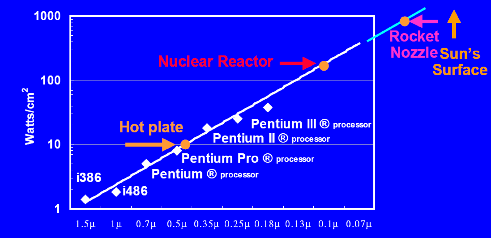
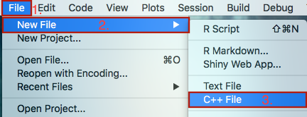
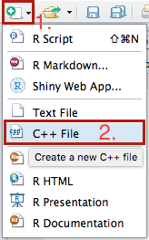
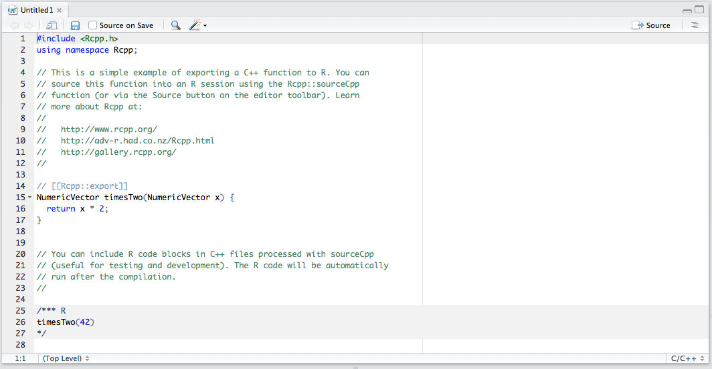

```{r setup, include=FALSE}
options(width = 60)
knitr::opts_chunk$set(echo = TRUE, cache = TRUE)
```

### On the Agenda

- High Performance Computing (HPC)
    - Processors
    - Performant code
- Compiled Code with Rcpp
    - C++ and Rcpp
   
# High Performance Computing

## Motivation

### Computing Quotation

> "If you were plowing a field, which would you rather use? Two strong oxen or 1024 chickens?"
> 
> --- Seymore Cray

### Computing Quotation - Explained

> "If you were plowing a field, which would you rather use? Two strong oxen or 1024 chickens?"
> 
> --- Seymore Cray

- Lets assume for a moment that 2 oxen and 1024 chickens 
may provide the same amount of power.
- The question being asked is would you rather *manage* 2 operations
or 1024 operations. 
- In essence, 1024 would cause mass confusion as you may not be able to 
focus the each operation into usable power. 

## Terminology

### Power and Processors

When talking about computing, part of the **power** a computer has is given by the
amount of information it can *process* within the Central Processing Unit.

### Processing Lingo 

**Central Processing Unit (CPU):**

A CPU is the brains of the computer that takes care of a majority of the calculations. 

```{r quad_core_cpu, out.width = "125px", fig.retina = NULL, fig.align='center', cache = TRUE, echo = FALSE}
knitr::include_graphics("img/cpu_i7.jpg")
```

### Processing Lingo Cont.

- **Core:**
    - A core represents a single CPU.
- **Multi-core processor**
    - A multi-core processor is a single component with two or more independent CPUs (cores) on the same die or block.

```{r quad_core, out.width = "100px", fig.retina = NULL, fig.align='center', cache = TRUE, echo = FALSE}
knitr::include_graphics(c("img/quad_core_inside.jpg","img/LFDDieLayout.jpg"))
```

### Processing Lingo Cont.

**Thread:**

A thread is a single line of commands that are getting processed by a CPU.
  
### Mmmm... High Performance Computing

**Definition:**

*High Performance Computing (HPC)* most generally refers to the practice of
aggregating computing power in a way that delivers much higher performance
than one could get out of a typical desktop computer or workstation in order to
solve large problems in science, engineering, or business.

$$ $$

**[Source](http://insidehpc.com/hpc-basic-training/what-is-hpc/)**

### Myths, damn myths, and...

There are many myths that exist around HPC... $$ $$
Here are some of them:

- Supercomputer or clusters only need apply 
- Way too expensive (\$\$\$) to implement 
- It's for Tech Firms or Academics
- Only useful for simulations
- There's no need for HPC in my field
- **This isn't available for R**

### The Humor of the Situation


**None of the myths are true!** 

In fact, we're barreling toward a future where it will be abnormal for code
to run longer than 5 seconds. 

### Rear Admiral Grace Hopper and Nanoseconds

](img/rear_admiral_grace_hopper.jpg)

- Start Time: 7m 36s

## Moving to HPC
### NCSA on why #HPCMatters!

](img/bluewaters_front.jpg)

Photo of NCSA's **[Blue Waters Supercomputer](http://www.ncsa.illinois.edu/enabling/bluewaters)**
here at UIUC!

### Why HPC? Why now?

- Part of the reason for **HPC** is the elephant in the room: **Big Data**. 
- Computers have come a long way from requiring an entire room to do simple
calculations to rendering movies and videos on a skinny jean pocket size iDevice.
- Though, to fully understand the *why* part, we need to talk about **Moore's law**
and how it relates to computing.

### Moore's Law

> "The complexity… has increased roughly a factor of two per year. [It] can be expected to continue…for at least 10 years"
> 
> --- Gordon Moore "Cramming More Components onto
> Integrated Circuits," Electronics, pp. 114–117, April 19, 1965

Commonly ***mis***stated as:

> "Computer performance doubles every 18 months"

**[Video](http://www.intel.com/content/www/us/en/silicon-innovations/moores-law-technology.html)**

### Moore's Law - Transistors and Moores

](img/transistors_and_moores.png)

### Moore's Law - Clockspeeds of Processors

](img/clockspeeds.jpg)

### Moore's Law - Processors

](img/moores-law.png)

### Moore's Law and Reality



### Full on Reality

- We are reaching / have reached a threshold with CPU performance.
- That is to say that we have become accustom to PCs becoming faster every year 
but the future holds a different kind of **change**.
- The next saga is writing high performing code, improving compilers, and using
parallelization.

# Rcpp
## Motivation

### *R* is dead, long live *R*?

- *R* is a wonderful language that allows for just about **anything**
- Each time *R* dies, it comes back stronger courtesy of community involvement.
- Every weakness gets addressed and extensions are made.

### The Problem with *R*

> "I like to think of *R* as one of the best programming languages with one of
> the worst 'standard libraries'"
>
> --- Kevin Ushey in [Needless Inefficiencies in R -- Head and Tail](http://kevinushey.github.io/blog/2015/01/04/needless-inefficiencies-1/)

- The downsides of a language for *statisticians* by *statisticians*. 

### *R* is dead, long live *R*?

The main staying power of *R* is:

- Interactively work with code
- Rapid prototyping (thanks to the interpreter)
- Syntax for statisticians by statisticians to explore data
- Top notch statistical methods
- Easy install and distribution (thanks [CRAN](https://cran.r-project.org/)!)
- Gateway or interface to other applications.

At the same time, R is incredibly weak in:

- Speed (downside of prototyping)
- Loops (*shudders*)
- Effective memory management (a bit aggressive on allocations)
- Multicore support (default compile of *R*'s BLAS is single core!)

### Why compile code for R?

The why for compiling code is able to be reduced to:

- Speed
    - Making things go fast is fun and beneficial in this age of instanteous
    response.
- More libaries and tools
    - Libraries outside of the scope of R (boost, GSL, Eigen, Armadillo) are 
    now able to be used!
- Great Support
    - There are countless answers to C++ questions and people willing to answer 
    them! e.g. [stackoverflow.com](http://stackoverflow)
- C++ is rock solid
    -  C++ has been battle tested in industry and academia alike.

### Why *Rcpp*?

*Rcpp* is: 

- **Well Documented**
    - [Rcpp Gallery has 100+ posts](http://gallery.rcpp.org/) and 
    [over 1100 unit tests](https://github.com/RcppCore/Rcpp/tree/master/inst/unitTests)
- **Straightforward to Use (with RStudio)**
    - Press a button and code compiles! No worries about using terminal.
- **Seamless access to all R objects**
    - Move back and forth between *R* and *C++* with easy. 

### Rise of Rcpp

](img/rise_of_rcpp_packages.jpg)

### Rise of Rcpp

](img/rise_of_rcpp.jpg)

### C++ Disclaimer

- C++ is a very **powerful** language. 
- We're only going to briefly cover parts that relate to *non*-complex operations.
     - See CS 225 for full treatement
- E.g things that *R* is inherently bad at like loops...

## Setup

### Setting Up the Environment

Depending on the *type* of Operating System, there are different types of
installations required.

Please see the guide for each operating system:

- [Windows](http://thecoatlessprofessor.com/programming/rcpp/install-rtools-for-rcpp/) (>= Windows 7)
- [macOS (basic)](http://thecoatlessprofessor.com/programming/r-compiler-tools-for-rcpp-on-os-x/) **or** [parallel on macOS (advanced)](http://thecoatlessprofessor.com/programming/openmp-in-r-on-os-x/)

### Creating C++ Files in RStudio

There are two ways to create a Cpp file within RStudio:

- **File** $\Rightarrow$ **New File** $\Rightarrow$ **C++ File** 

```{r cpp_file_create_dropdown, out.width = "125px", fig.retina = NULL, fig.align='center', cache = TRUE, echo = FALSE}

```

- **New Document Symbol** $\Rightarrow$ **C++ File** 

```{r cpp_file_create, out.width = "100px", fig.retina = NULL, fig.align='center', cache = TRUE, echo = FALSE}

```

### Results In...

- Standard Rcpp templated file with an *example*

```{r rcpp_in_rstudio, out.width = "325px", fig.retina = NULL, fig.align='center', cache = TRUE, echo = FALSE}

```

- **Save** the file as: `rcpp_twotimes.cpp`

### Compiling...

Three different ways to trigger a compilation of C++ code in a `.cpp` file:

- Use one of RStudio's keyboard shortcuts! 
    - All OSes: `Ctrl` + `Shift` + `Enter`
- Type into console:

```{r eval = F}
Rcpp::sourceCpp("rcpp_twotimes.cpp")
```
- Press the `Source` button at the top right of the editor window.

```{r rcpp_source, out.width = "125px", fig.retina = NULL, fig.align='center', cache = TRUE, echo = FALSE}

```

### Output ...

```{r eval = F}
timesTwo(42)
## [1] 84
```

Note: This output was **automatic** after compiling the code due to 
the comment at the end. 

## Compilation

### Kinds of Compiling Techniques with Rcpp

There are three ways to compile code without embedding it within an R package.

1. `evalCpp()` 
    - To quickly check different C++ expressions.
    - Limited scope
1. `cppFunction()` 
    - For defining inline function code
    - Limit 1 function per call. 
1. `sourceCpp()` 
    - For code kept in an alternative file
    - Multiple files with interfunction dependence.
    - This is the **preferred** way to work with Rcpp code.
    
### Main compilation technique

- For all intents and purposes, we will use `sourceCpp()` to compile C++ code.
- `sourceCpp()` is better as it allows for C++ syntax highlighting whereas
`cppFunction()` loses the C++ syntax highlighting due to the string context.

## File Naming

### C++ File Names

- When working with C++, avoid avoid using spaces or special symbols in either
the file path or file name.
     - File Name: `example.cpp`
     - File Path: `/home/netid/example.cpp`
- If you need to use a space, use the underscore: `_`

**Examples:**

- Good: `rcpp_example.cpp`, `hello2rcpp.cpp`
- Bad: `C++ Example.cpp`, `rcpp is the bees knees.cpp`
  
## Libraries

### C++ vs. R - Libraries

- To include different libraries using header (`.h`) files akin to *R*'s 
`library()` function, write in the C++ file:

```{Rcpp eval = F}
#include <Rcpp.h>     // Includes the Rcpp C++ header
                      // Akin to calling library(Rcpp)
                      // in C++
```

- Unlike *R*, we also have to explicitly add the namespace of a header that
we wish to use.

```{Rcpp eval = F}
using namespace Rcpp; // C++ search scope
```

### C++ vs. R - Libraries

All C++ files must therefore have at the top of them:

```{Rcpp eval = F}
#include <Rcpp.h>     // Includes the Rcpp C++ header
using namespace Rcpp; // C++ search scope
```

### C++ vs. R - Note on Namespaces of Libraries

- Specifying the namespace avoids having to prefix function calls with the `Rcpp::` 
namespace.

- **Note:** This is *not* a good style but it makes beginning in `C++` a bit easier.
- In particular, ambiguity is introduced into the code when two libraries
provide functions with the same name (e.g. `std::sqrt` and `arma::sqrt`). 
- *R* would warn when this overload happens on package load, *C++* will **not**.

## C++ Code

### C++ vs. R - Commenting in Code

Comments in C++ come in two flavors:

```{Rcpp eval = F}
/* Group comment
 Across Multiple Lines
 */

// Single line comment
```

The use of *R*'s traditional comment:
```{r}
# pound/hash commment
```
is used to declare preprocessor macros and, thus, should **not** be used within
a `C++` file.

### Steps toward a C++ Function

- Before writing a C++, try to write the function in *R* first. 

- Consider an *R* function called `hello` whose goal is to print "Hello R/C++ World!"

```{r eval = F}
hello = function(){
  cat("Hello R/C++ World!\n")
}
```

### C++ vs. R - First Function in C++

We can mimic this by creating the following *C++* function.

```{Rcpp hello_world_ex2, eval = F}
// Akin to cat("Hello R/C++ World!\n")
void hello() {                      // Declaration
  Rcout << "Hello R/C++ World!\n";  // cat() in C++
}
```

Differences between *R* and *C++*:

- Return type of the function `void` is specified before function name.
- `void` indicates that no information is *returned*. 
- `cat()` is done using `Rcout` with strings being delimiters of by `<<`. 

### First Function in C++ within R

In order to write a C++ function that works with *R*, you must specify 
the intent to export into *R* by writing directly above the function
the **[Rcpp Export Attribute](https://cran.r-project.org/web/packages/Rcpp/vignettes/Rcpp-attributes.pdf)**

```{Rcpp, eval = F}
// [[Rcpp::export]]
```

e.g. 
```{Rcpp hello_world_ex}
#include <Rcpp.h>
using namespace Rcpp;

// [[Rcpp::export]]
void hello() {
  Rcout << "Hello R/C++ World!\n";  
}
```

### Compile it!

Pick one of the ways listed previously to compile:

```{Rcpp}
<<hello_world_ex>>
```

### Calling the C++ Function within *R*

C++ functions are automatically surfaced into the *R* environment by *Rcpp* 
under their defined name. So, in the previous example, we would have `hello()`
in the global environment that we can now call.

```{r}
# Call C++ Code like a normal R function
hello()    
```

### Automatically Run *R* Code on C++ Compile

To automatically test code after compile, you can embed the R code in special C++
group comment blocks like so:

```{Rcpp}
<<hello_world_ex>>
/*** R
# This is R code in the C++ code file!
hello()
*/
```


### C++ Function within *R*

The insides of the C++ function are slightly different

```{r}
hello
```

This is only problematic when you are trying to do cluster computing (more later).

## Addition Example

### Parameter Functions in *R*

- The beauty of a function is being able to slightly change variables and obtain
a new input. 
- To add only *two* numbers, an `add()` can be created as:

```{r}
add = function(a,b){
  return(a + b)
}

add(0L, 2L)   # Remember L means integer!
add(2.5, 1.1) # Double/numeric
```

### C++ vs. R - Parameter Functions

Difference between an *R* function and that of a *C++* function are as follows:

1. Return data type
2. Data type of input parameters

```{Rcpp}
#include <Rcpp.h>
using namespace Rcpp;           // Import Statements

// [[Rcpp::export]]
double addRcpp(double a, double b) { // Declaration
  double out = a + b; // Add `a` to `b`
  return out;         // Return output
}
```

**Note:** Everything must be **pre-typed**.

## Typing Issues

### Calling the C++ `addRcpp()` function

- You may have noticed that there should be a *typing* issue that arises. 
- *Rcpp* is kind and allows for the seamless conversion of `integers` in *R* 
to `doubles` in C++.

```{r}
add(0L, 2L)   # Integers into double
add(2.5, 1.1) # Double into double
```

### Calling another C++ function with different types

```{Rcpp}
#include <Rcpp.h>
using namespace Rcpp;           // Import Statements

// [[Rcpp::export]]
double addRcpp(double a, double b) { // Declaration
  double out = a + b;           // Add `a` to `b`
  return out;                   // Return output
}

// [[Rcpp::export]]
int addRcppInt(int a, int b) { // Declaration
  return addRcpp(a, b);        // Call previous function
}
```

### Calling the C++ `addRcpp()` function with clashing types

Note, C++ will even *try* to handle the conversion between `int` and `double`.

```{r}
addRcppInt(2.5, 1.1)  # Call in *R*
```

Follows *bias* rounding procedure of:

- If $x <= 0.5$, then round down: $\left\lfloor {y} \right\rfloor$ (floor)
- If $x > 0.5$, then round up: $\left\lceil {y} \right\rceil$ (ceiling)

where $x$ is the fractional component of $z$ and $y$ is the integer component
of $z$, e.g. $x = 0.3, y = 2 \Rightarrow z = 2.3$

- Why is the output *3* instead of *4*? 

### C++ vs. R - Functions

Data Types to choose from: 

- `double`: 1 numeric
- `int`: 1 integer
- `std::string`: 1 character
- `void`: nothing
- `*Vector`: vector of either `Integer`, `Numeric`, or `Character`
- `*Matrix`: matrix of either `Integer`, `Numeric`, or `Character`

**Pay Attention to Your Data Types!**

## Mean Function

### R - Mean Function 

Recall that \[{\bar x_n} = \frac{1}{n}\sum\limits_{i = 1}^n {{x_i}} \]

Given by:

```{r}
muR = function(x) {
  sum_r = 0
  for (i in seq_along(x)) {
    sum_r = sum_r + x[i]
  }
  
  sum_r / length(x)
}
```

### C++ - Mean Function

**Goal:** Obtain the Mean of a vector. 

```{Rcpp mean}
#include <Rcpp.h>
using namespace Rcpp;           // Import Statements

// [[Rcpp::export]]
double muRcpp(NumericVector x) { // Declaration
  
  int n = x.size();              // Find the vector length
  double sum_x = 0;              // Set up storage

  for(int i = 0; i < n; ++i) {   // For Loop in C++
    // Shorthand for sum_x = sum_x + x[i];
    sum_x += x[i];   
  }
  return sum_x / n;             // Return division
}
```

### Checking C++ and R Function Equality

Check the equality of both functions using `all.equal()`

```{r}
# Done in *R*

set.seed(112)                # Set seed

x = rnorm(10)                # Generate data

all.equal(muRcpp(x), muR(x)) # Test Functions
```

## Proxy Model

### Rcpp Proxy Model

- All objects using the `*Vector` or `*Matrix` tags are **proxy** objects. 
- That means, they are acting as pointers to the actual memory. 
- So, the call to function has *Rcpp* objects being passed by **reference**.


### Rcpp Proxy Model - Example

```{Rcpp proxy_success}
#include <Rcpp.h>
using namespace Rcpp;           // Import Statements

// [[Rcpp::export]]
void ref_ex(IntegerVector x) { // Declaration
  x = x + 1; // Add 1 and save it to x via Rcpp Sugar
}
```

```{r}
(x = 1:10)  # Span from 1 to 10
ref_ex(x)   # No output due to no return
x           # Different Span!
```

### Rcpp Proxy Model - Trouble Ho!

The proxy model works reasonably well to a degree...

```{r}
(x = seq(0.5,5.5))  # Span from 0.5 to 5.5
ref_ex(x)            # No output due to no return
x                    # Same span????
```

### Rcpp Proxy Model - The failures

- Note that the type of `x` is `numeric` in this case and not `integer` like before.
    - Check yourself via:
```{r eval = F}
typeof(x)
```
- Thus, the Rcpp proxy model **failed** to use existing memory and created a new
object since it expected type `IntegerVector` but had to cast from `NumericVector`.

### Lesson of the Day...

**Pay Attention to Your Data Types!**

### Misc Note on Compiling Techniques with Rcpp

- When calling both the `cppFunction()` and `evalCpp()` there is
a call to the `sourceCpp()` to generate the object. This is a really effective
code design.

- For details see: **[Rcpp Attributes Vignette](https://cran.r-project.org/web/packages/Rcpp/vignettes/Rcpp-attributes.pdf)** and **[Code Source](https://github.com/RcppCore/Rcpp/blob/ca82a84e892bb6f825d3a4cbde380092caba6425/R/Attributes.R#L295-L300)**

